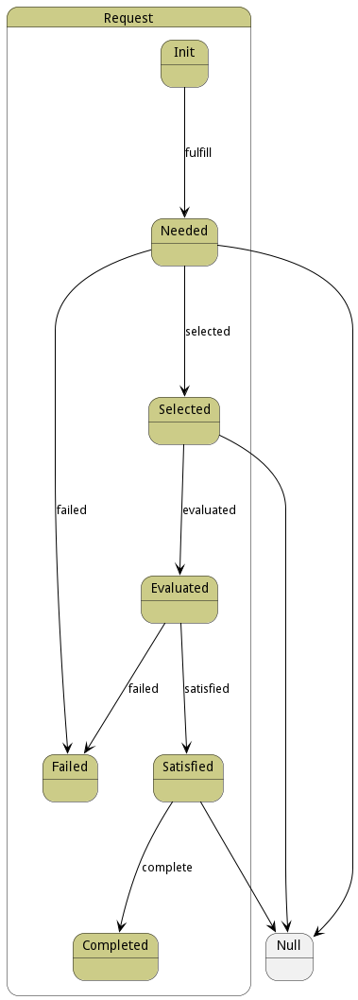

# Request

This represents a request being made for a resource in the cloud. This is only the request a set of reservations will be created for each request. When the request is satisfied the requestwill change state to Satisfied, and be returned to the requesterlong description

## Attributes

* name:string - Name of the request being made
* ename:string - Extended Name of the request being made. It contains the lineage of the request in the name
* type:string - This is the type of resource being requested
* message:string - Last message about the request

## Associations

| Name | Cardinality | Class | Composition | Owner | Description |
| --- | --- | --- | --- | --- | --- |
| requirements | 1 | MetricComposite | true | true |  |
| reservations | n | Reservation | false | true |  |
| resources | n | Resource | false | true |  |
| cloud | 1 | Cloud | false | false |  |
| datacenters | n | DataCenter | false | false |  |
| devices | n | Device | false | false |  |
| aggregates | n | AggregatedDevice | false | false |  |

## Users of the Model

| Name | Cardinality | Class | Composition | Owner | Description |
| --- | --- | --- | --- | --- | --- |
| requests | n | Cloud | false | true |  |
| request | 1 | Reservation | false | false |  |
| request | 1 | Resource | false | false |  |
| request | 1 | AcceleratorResource | false | false |  |
| request | 1 | ComputeResource | false | false |  |
| request | 1 | NetworkResource | false | false |  |
| request | 1 | StorageResource | false | false |  |

## State Net
The Request has a state net corresponding to instances of the class. Each state transistion will emit an 
event that can be caught with a websocket client. The name of the event is the name of the state in all lower case.
The following diagram is the state net for this class.

| Name | Description | Events |
| --- | --- | --- |
| Init | Initial state for the Request. | fulfill-&gt;Needed,  |
| Needed | Request needs to be satisfied. Anyone that can satisfy it should be notified. | selected-&gt;Selected, failed-&gt;Failed,  |
| Failed | The Request has failed to be fully satisfied. All reservations are rejected |  |
| Selected | The Request has been selected for target. Reservations are created. | evaluated-&gt;Evaluated,  |
| Satisfied | The Request if fully satisfied. The Reservations have been rejected or accepted | complete-&gt;Completed,  |
| Evaluated | The Request has been evaluated but not satisfied yet. | satisfied-&gt;Satisfied, failed-&gt;Failed,  |
| Completed | The Request is completed. |  |

## Methods

* [confirm() - Description of the method](#action-confirm)

* [evaluated() - The Request is evaluated](#action-evaluated)

* [failed() - Request Failed](#action-failed)

* [fulfill() - Fulfill the request, the state of the request is moved to needed](#action-fulfill)

* [satisfied() - The Request is staisfied](#action-satisfied)

<h2>Method Details</h2>
    
### Action request confirm

* REST - request/confirm?attr1=string
* bin - request confirm --attr1 string
* js - request.confirm({ attr1:string })

#### Description
Description of the method

#### Parameters

| Name | Type | Required | Description |
|---|---|---|---|
| attr1 | string |false | Description for the parameter |

### Action request evaluated

* REST - request/evaluated?
* bin - request evaluated 
* js - request.evaluated({  })

#### Description
The Request is evaluated

#### Parameters

No parameters

### Action request failed

* REST - request/failed?message=string
* bin - request failed --message string
* js - request.failed({ message:string })

#### Description
Request Failed

#### Parameters

| Name | Type | Required | Description |
|---|---|---|---|
| message | string |false | Reason why this failed |

### Action request fulfill

* REST - request/fulfill?datacenters=object&amp;devices=object&amp;aggregates=object
* bin - request fulfill --datacenters object --devices object --aggregates object
* js - request.fulfill({ datacenters:object,devices:object,aggregates:object })

#### Description
Fulfill the request, the state of the request is moved to needed

#### Parameters

| Name | Type | Required | Description |
|---|---|---|---|
| datacenters | object |true | Datacenters to be used for the fulfillment |
| devices | object |true | Devices to be used for the fulfillment |
| aggregates | object |true | Aggregates to be used for the fulfillment |

### Action request satisfied

* REST - request/satisfied?
* bin - request satisfied 
* js - request.satisfied({  })

#### Description
The Request is staisfied

#### Parameters

No parameters

