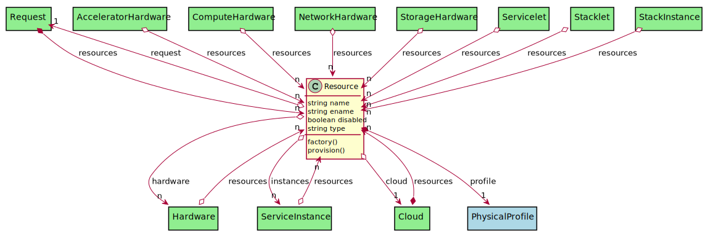
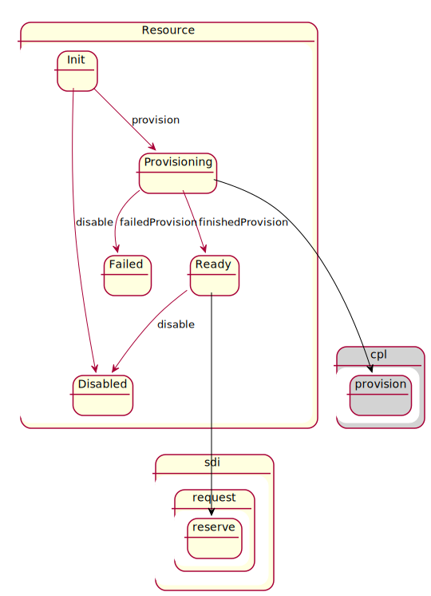

# Resource

Resource in the cloud. Can be network, storage or compute.

## Attributes

* name:string - Name of the resource
* ename:string - Extended name of the resource
* disabled:boolean - Disabled Resource
* type:string - Type of resource, Network, Storage, Compute or Accelerator

## Associations

| Name | Cardinality | Class | Composition | Owner | Description |
| --- | --- | --- | --- | --- | --- |
| request | 1 | Request | false | false |  |
| profile | 1 | PhysicalProfile | true | true |  |
| hardware | n | Hardware | false | false |  |
| instances | n | ServiceInstance | false | false |  |
| cloud | 1 | Cloud | false | false |  |

## Users of the Model

| Name | Cardinality | Class | Composition | Owner | Description |
| --- | --- | --- | --- | --- | --- |
| resources | n | AcceleratorHardware | false | false |  |
| resources | n | ComputeHardware | false | false |  |
| resources | n | Hardware | false | false |  |
| resources | n | NetworkHardware | false | false |  |
| resources | n | StorageHardware | false | false |  |
| resources | n | Servicelet | false | false | resource requests for the servicelet |
| resources | n | Stacklet | false | false | resource requests for the servicelet |
| resources | n | ServiceInstance | false | false | Resources used to host this service instance |
| resources | n | StackInstance | false | false | Resources used to host this service instance |
| resources | n | Cloud | false | true |  |
| resources | n | Request | false | true |  |

## State Net

| Name | Description | Events |
| --- | --- | --- |
| Init |  | provision-&gt;Provisioning, disable-&gt;Disabled,  |
| Provisioning |  | finishedProvision-&gt;Ready, failedProvision-&gt;Failed,  |
| Failed |  |  |
| Ready |  | disable-&gt;Disabled,  |
| Disabled |  |  |

## Methods

* [factory() - Create a Resource based on the hardware to resource table](#action-factory)

* [provision() - Provision the Resource](#action-provision)

<h2>Method Details</h2>
    
### Action resource factory

* REST - resource/factory
* bin - resource factory
* js - resource.factory

Create a Resource based on the hardware to resource table

| Name | Type | Required | Description |
|---|---|---|---|
| name | string |true | name of the Resource |
| value | object |true | value of the hardware |

### Action resource provision

* REST - resource/provision
* bin - resource provision
* js - resource.provision

Provision the Resource

| Name | Type | Required | Description |
|---|---|---|---|

