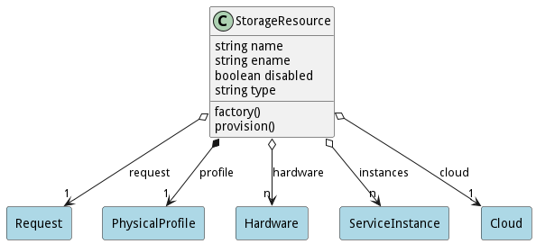

# StorageResource

Logical Resource of Network that are provisioned

## Attributes

* name:string - Name of the resource
* ename:string - Extended name of the resource
* disabled:boolean - Disabled Resource
* type:string - Type of resource, Network, Storage, Compute or Accelerator

## Associations

| Name | Cardinality | Class | Composition | Owner | Description |
| --- | --- | --- | --- | --- | --- |
| request | 1 | Request | false | false |  |
| profile | 1 | PhysicalProfile | true | true |  |
| hardware | n | Hardware | false | false |  |
| instances | n | ServiceInstance | false | false |  |
| cloud | 1 | Cloud | false | false |  |

## Methods

* [factory() - Create a Resource based on the hardware to resource table](#action-factory)

* [provision() - Provision the Resource](#action-provision)

<h2>Method Details</h2>
    
### Action storageresource factory

* REST - storageresource/factory?name=string&amp;value=object
* bin - storageresource factory --name string --value object
* js - storageresource.factory({ name:string,value:object })

#### Description
Create a Resource based on the hardware to resource table

#### Parameters

| Name | Type | Required | Description |
|---|---|---|---|
| name | string |true | name of the Resource |
| value | object |true | value of the hardware |

### Action storageresource provision

* REST - storageresource/provision?
* bin - storageresource provision 
* js - storageresource.provision({  })

#### Description
Provision the Resource

#### Parameters

No parameters

