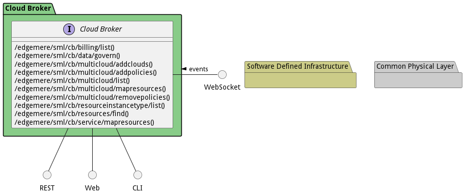

# Cloud Broker

Cloud Broker is a subsystem that creates multi-clouds and manages their policies, services, clouds, and resource instance types. 

## Use Cases

The following are the use cases of the Cloud Broker subsystem. Each use case has primary and secondary scenarios
that are elaborated in the use case descriptions.

* [Find Resources](usecase-FindResources)
* [ManageBilling](usecase-ManageBilling)
* [ManageCostModel](usecase-ManageCostModel)
* [Manage Multi Cloud](usecase-ManageMultiCloud)
* [Map Assets to Cloud](usecase-MapAssetstoCloud)
* [Map Services to Resources](usecase-MapServicestoResources)

## Users

The following are the actors of the Cloud Broker subsystem. This can include people, other subsystems
inside the solution and even external subsystems.

* [ITOperations](actor-itops)

## Interface

The subsystem has a REST, CLI, WebSocket, and Web interface. Use Cases and Scenarios can use any or all
of the interfaces to perform the work that needs to be completed. The following  diagram shows how
users interact with the system.

* [ edgemere sml cb billing list](#action--edgemere-sml-cb-billing-list)
* [ edgemere sml cb data govern](#action--edgemere-sml-cb-data-govern)
* [ edgemere sml cb multicloud addclouds](#action--edgemere-sml-cb-multicloud-addclouds)
* [ edgemere sml cb multicloud addpolicies](#action--edgemere-sml-cb-multicloud-addpolicies)
* [ edgemere sml cb multicloud list](#action--edgemere-sml-cb-multicloud-list)
* [ edgemere sml cb multicloud mapresources](#action--edgemere-sml-cb-multicloud-mapresources)
* [ edgemere sml cb multicloud removepolicies](#action--edgemere-sml-cb-multicloud-removepolicies)
* [ edgemere sml cb resourceinstancetype list](#action--edgemere-sml-cb-resourceinstancetype-list)
* [ edgemere sml cb resources find](#action--edgemere-sml-cb-resources-find)
* [ edgemere sml cb service mapresources](#action--edgemere-sml-cb-service-mapresources)

## Logical Artifacts

The Data Model for the  Cloud Broker subsystem shows how the different objects and classes of object interact
and their structure.

### Sub Packages

The Cloud Broker subsystem has sub packages as well. These subsystems are logical components to better
organize the architecture and make it easier to analyze, understand, design, and implement.

### Classes

The following are the classes in the data model of the Cloud Broker subsystem.

* [CloudType](class-CloudType)
* [ResourceCost](class-ResourceCost)
* [ResourceInstanceType](class-ResourceInstanceType)
* [ResourceMap](class-ResourceMap)

## Deployment Architecture

This subsystem is deployed using micro-services as shown in the diagram below. The 'micro' module is
used to implement the micro-services in the system. The subsystem also has an CLI, REST and Web Interface
exposed through a nodejs application. The nodejs application will interface with the micro-services and
can monitor and drive work-flows through the mesh of micro-services. The deployment of the subsystem is
dependent on the environment it is deployed. This subsystem has the following environments:
* [dev](environment--edgemere-sml-cb-dev)
* [test](environment--edgemere-sml-cb-test)
* [prod](environment--edgemere-sml-cb-prod)

## Physical Architecture

The Cloud Broker subsystem is physically laid out on a hybrid cloud infrastructure. Each microservice belongs
to a secure micro-segmented network. All of the micro-services communicate to each other and the main app through a
REST interface. A Command Line Interface (CLI), REST or Web User interface for the app is how other subsystems or actors
interact. Requests are forwarded to micro-services through the REST interface of each micro-service. The subsystem has
the a unique layout based on the environment the physical space. The following are the environments for this
subsystems.
* [dev](environment--edgemere-sml-cb-dev)
* [test](environment--edgemere-sml-cb-test)
* [prod](environment--edgemere-sml-cb-prod)

## Micro-Services

These are the micro-services for the subsystem. The combination of the micro-services help implement
the subsystem's logic.

### dev

Detail information for the [dev environment](environment--edgemere-sml-cb-dev)
can be found [here](environment--edgemere-sml-cb-dev)

Services in the dev environment

* frontend : sml_cb_web
* gw : sml_cb_gw

### test

Detail information for the [test environment](environment--edgemere-sml-cb-test)
can be found [here](environment--edgemere-sml-cb-test)

Services in the test environment

* frontend : sml_cb_web
* gw : sml_cb_gw

### prod

Detail information for the [prod environment](environment--edgemere-sml-cb-prod)
can be found [here](environment--edgemere-sml-cb-prod)

Services in the prod environment

* frontend : sml_cb_web
* gw : sml_cb_gw

## Activities and Flows
The Cloud Broker subsystem provides the following activities and flows that help satisfy the use
cases and scenarios of the subsystem.

### Messages Sent

| Event | Description | Emitter |
|-------|-------------|---------|
| cloudtype.create |  When an object of type CloudType is created. | CloudType
| cloudtype.destroy |  When an object of type CloudType is destroyed. | CloudType
| cloudtype.updated |  When an object of type CloudType has an attribute or association updated. | CloudType
| resourcecost.create |  When an object of type ResourceCost is created. | ResourceCost
| resourcecost.destroy |  When an object of type ResourceCost is destroyed. | ResourceCost
| resourcecost.updated |  When an object of type ResourceCost has an attribute or association updated. | ResourceCost
| resourceinstancetype.create |  When an object of type ResourceInstanceType is created. | ResourceInstanceType
| resourceinstancetype.destroy |  When an object of type ResourceInstanceType is destroyed. | ResourceInstanceType
| resourceinstancetype.updated |  When an object of type ResourceInstanceType has an attribute or association updated. | ResourceInstanceType
| resourcemap.create |  When an object of type ResourceMap is created. | ResourceMap
| resourcemap.destroy |  When an object of type ResourceMap is destroyed. | ResourceMap
| resourcemap.updated |  When an object of type ResourceMap has an attribute or association updated. | ResourceMap

## Interface Details
The Cloud Broker subsystem has a well defined interface. This interface can be accessed using a
command line interface (CLI), REST interface, and Web user interface. This interface is how all other
subsystems and actors can access the system.

### Action  edgemere sml cb billing list

* REST - /edgemere/sml/cb/billing/list?attr1=string
* bin -  edgemere sml cb billing list --attr1 string
* js - .edgemere.sml.cb.billing.list({ attr1:string })

#### Description
Description of the action

#### Parameters

| Name | Type | Required | Description |
|---|---|---|---|
| attr1 | string |false | Description for the parameter |

### Action  edgemere sml cb data govern

* REST - /edgemere/sml/cb/data/govern?attr1=string
* bin -  edgemere sml cb data govern --attr1 string
* js - .edgemere.sml.cb.data.govern({ attr1:string })

#### Description
Description of the action

#### Parameters

| Name | Type | Required | Description |
|---|---|---|---|
| attr1 | string |false | Description for the parameter |

### Action  edgemere sml cb multicloud addclouds

* REST - /edgemere/sml/cb/multicloud/addclouds?attr1=string
* bin -  edgemere sml cb multicloud addclouds --attr1 string
* js - .edgemere.sml.cb.multicloud.addclouds({ attr1:string })

#### Description
Description of the action

#### Parameters

| Name | Type | Required | Description |
|---|---|---|---|
| attr1 | string |false | Description for the parameter |

### Action  edgemere sml cb multicloud addpolicies

* REST - /edgemere/sml/cb/multicloud/addpolicies?attr1=string
* bin -  edgemere sml cb multicloud addpolicies --attr1 string
* js - .edgemere.sml.cb.multicloud.addpolicies({ attr1:string })

#### Description
Description of the action

#### Parameters

| Name | Type | Required | Description |
|---|---|---|---|
| attr1 | string |false | Description for the parameter |

### Action  edgemere sml cb multicloud list

* REST - /edgemere/sml/cb/multicloud/list?attr1=string
* bin -  edgemere sml cb multicloud list --attr1 string
* js - .edgemere.sml.cb.multicloud.list({ attr1:string })

#### Description
Description of the action

#### Parameters

| Name | Type | Required | Description |
|---|---|---|---|
| attr1 | string |false | Description for the parameter |

### Action  edgemere sml cb multicloud mapresources

* REST - /edgemere/sml/cb/multicloud/mapresources?attr1=string
* bin -  edgemere sml cb multicloud mapresources --attr1 string
* js - .edgemere.sml.cb.multicloud.mapresources({ attr1:string })

#### Description
Description of the action

#### Parameters

| Name | Type | Required | Description |
|---|---|---|---|
| attr1 | string |false | Description for the parameter |

### Action  edgemere sml cb multicloud removepolicies

* REST - /edgemere/sml/cb/multicloud/removepolicies?attr1=string
* bin -  edgemere sml cb multicloud removepolicies --attr1 string
* js - .edgemere.sml.cb.multicloud.removepolicies({ attr1:string })

#### Description
Description of the action

#### Parameters

| Name | Type | Required | Description |
|---|---|---|---|
| attr1 | string |false | Description for the parameter |

### Action  edgemere sml cb resourceinstancetype list

* REST - /edgemere/sml/cb/resourceinstancetype/list?attr1=string
* bin -  edgemere sml cb resourceinstancetype list --attr1 string
* js - .edgemere.sml.cb.resourceinstancetype.list({ attr1:string })

#### Description
Description of the action

#### Parameters

| Name | Type | Required | Description |
|---|---|---|---|
| attr1 | string |false | Description for the parameter |

### Action  edgemere sml cb resources find

* REST - /edgemere/sml/cb/resources/find?attr1=string
* bin -  edgemere sml cb resources find --attr1 string
* js - .edgemere.sml.cb.resources.find({ attr1:string })

#### Description
Description of the action

#### Parameters

| Name | Type | Required | Description |
|---|---|---|---|
| attr1 | string |false | Description for the parameter |

### Action  edgemere sml cb service mapresources

* REST - /edgemere/sml/cb/service/mapresources?attr1=string
* bin -  edgemere sml cb service mapresources --attr1 string
* js - .edgemere.sml.cb.service.mapresources({ attr1:string })

#### Description
Description of the action

#### Parameters

| Name | Type | Required | Description |
|---|---|---|---|
| attr1 | string |false | Description for the parameter |

