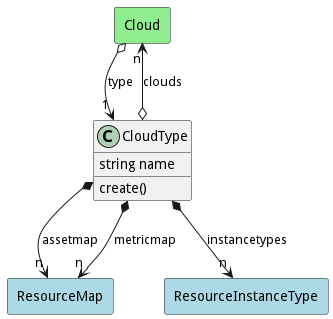

# CloudType

Each Cloud has a specific type of cloud it is tied to. The type of cloud helps with the deployment and mapping of assets across the different types of clouds. Examples of Cloud types are aws,azure,vmware openstack, google, nutanix, ...

## Attributes

* name:string - Name of the Cloud Type

## Associations

| Name | Cardinality | Class | Composition | Owner | Description |
| --- | --- | --- | --- | --- | --- |
| clouds | n | Cloud | false | false |  |
| assetmap | n | ResourceMap | true | true | This map allows mapping normalized resource types to specific cloud resource types for this cloud type |
| instancetypes | n | ResourceInstanceType | true | true | This is a list of resource types for the cloud type |
| metricmap | n | ResourceMap | true | true | This maps metrics from the cloud to the normalized metrics |

## Users of the Model

| Name | Cardinality | Class | Composition | Owner | Description |
| --- | --- | --- | --- | --- | --- |
| type | 1 | Cloud | false | false |  |

## Methods

* [create() - Create a Cloud Type](#action-create)

<h2>Method Details</h2>
    
### Action cloudtype create

* REST - cloudtype/create?name=string&amp;file=YAML
* bin - cloudtype create --name string --file YAML
* js - cloudtype.create({ name:string,file:YAML })

#### Description
Create a Cloud Type

#### Parameters

| Name | Type | Required | Description |
|---|---|---|---|
| name | string |true | name of the Cloud Type |
| file | YAML |false | file with the definition |

