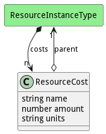

# ResourceCost

Cost of the Resource

## Attributes

* name:string - Name of the cost of the resource
* amount:number - Amount of the cost
* units:string - Unit of measure

## Associations

| Name | Cardinality | Class | Composition | Owner | Description |
| --- | --- | --- | --- | --- | --- |
| parent | 1 | ResourceInstanceType | false | false |  |

## Users of the Model

| Name | Cardinality | Class | Composition | Owner | Description |
| --- | --- | --- | --- | --- | --- |
| costs | n | ResourceInstanceType | true | true | Cost model for the Resource Instance Type |

## Methods

<h2>Method Details</h2>
    

