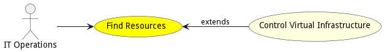

# Find Resources

Find Resources that have been allocated in the multi-cloud ecosystem. This should give the actor the ability to find resources based on id, name, or metrics.

## Actors

* [IT Operations](actor-itops)

## Detail Scenarios

