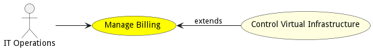

# ManageBilling

ManageBilling allows the IT Operations Manager to establish periodic billing for the usage of the resources allocated for the services deployed into the cloud. The accounting and billing should be accessible for users and groups of users.

## Actors

* [IT Operations](actor-itops)

## Detail Scenarios

