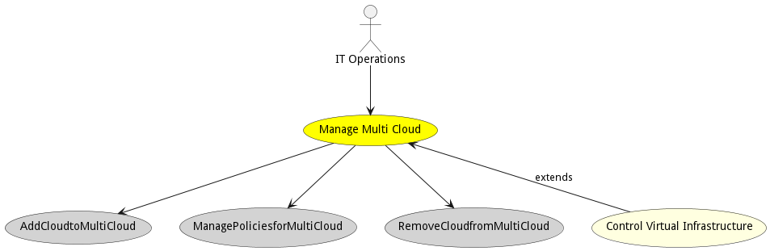
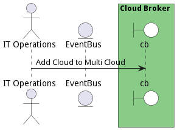
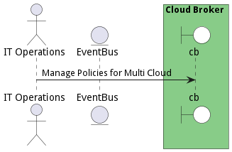

# Manage Multi Cloud

Manage Multi Cloud allows actors to create multi-clouds by adding clouds. Management of policies for the multi-cloud and all of the services deployed to a multi-cloud is performed by IT Operations.

## Actors

* [IT Operations](actor-itops)

## Detail Scenarios

* [AddCloudtoMultiCloud](#scenario-AddCloudtoMultiCloud)
* [ManagePoliciesforMultiCloud](#scenario-ManagePoliciesforMultiCloud)
* [RemoveCloudfromMultiCloud](#scenario-RemoveCloudfromMultiCloud)

### Scenario Add Cloud to Multi Cloud

It Operations adds clouds to the multicloud

#### Steps

1. To Be Defined

#### Actors

* [IT Operations](actor-itops)

### Scenario Manage Policies for Multi Cloud

IT Operations adds,removes,enables and disables policies to a multicloud

#### Steps

1. To Be Defined

#### Actors

* [IT Operations](actor-itops)

### Scenario Manage Policies for Multi Cloud

IT Operations removes or adds policies from Multi Cloud

#### Steps

1. To Be Defined

#### Actors

* [IT Operations](actor-itops)

