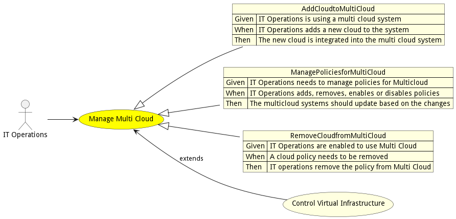
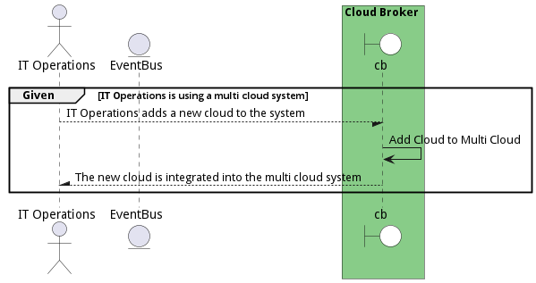
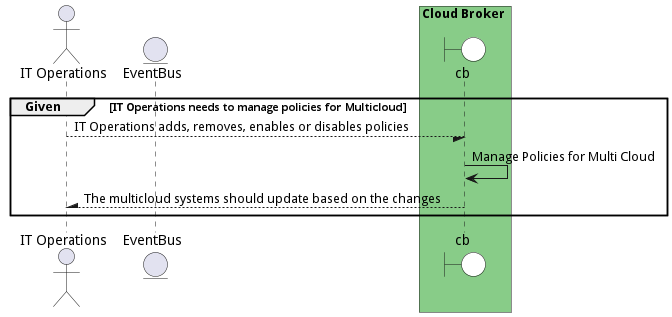

# Manage Multi Cloud

Manage Multi Cloud allows actors to create multi-clouds by adding clouds. Management of policies for the multi-cloud and all of the services deployed to a multi-cloud is performed by IT Operations.

## Actors

* [IT Operations](actor-itops)

## Extends Use Cases

* [Control Virtual Infrastructure](usecase-ControlVirtualInfrastructure)

## Detail Scenarios

* [AddCloudtoMultiCloud](#scenario-AddCloudtoMultiCloud)
* [ManagePoliciesforMultiCloud](#scenario-ManagePoliciesforMultiCloud)
* [RemoveCloudfromMultiCloud](#scenario-RemoveCloudfromMultiCloud)

### Scenario Add Cloud to Multi Cloud

It Operations adds clouds to the multicloud

#### Criteria

* Given - IT Operations is using a multi cloud system
* When - IT Operations adds a new cloud to the system
* Then - IT Operations is using a multi cloud system

#### Steps
1. To Be Defined

#### Actors

* [IT Operations](actor-itops)

### Scenario Manage Policies for Multi Cloud

IT Operations adds,removes,enables and disables policies to a multicloud

#### Criteria

* Given - IT Operations needs to manage policies for Multicloud
* When - IT Operations adds, removes, enables or disables policies
* Then - IT Operations needs to manage policies for Multicloud

#### Steps
1. To Be Defined

#### Actors

* [IT Operations](actor-itops)

### Scenario Remove Cloud From Multi Cloud

IT Operations removes or adds policies from Multi Cloud

#### Criteria

* Given - IT Operations are enabled to use Multi Cloud
* When - A cloud policy needs to be removed
* Then - IT Operations are enabled to use Multi Cloud

#### Steps
1. To Be Defined

#### Actors

* [IT Operations](actor-itops)

