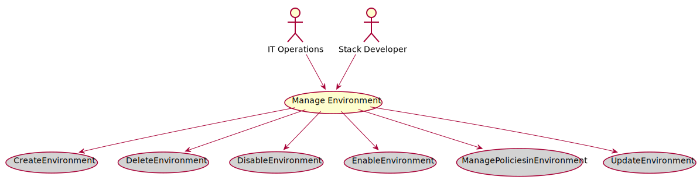

# Manage Environment

Manage Environment allows the actors (IT Operations and Stack Developer) to create environments, and establish policies for services running in the environment.

## Actors

* [IT Operations](actor-itops)
* [Stack Developer](actor-stackdev)

## Detail Scenarios

* [Manage Environment](#scenario-CreateEnvironment)
* [Manage Environment](#scenario-DeleteEnvironment)
* [Manage Environment](#scenario-DisableEnvironment)
* [Manage Environment](#scenario-EnableEnvironment)
* [Manage Environment](#scenario-ManagePoliciesinEnvironment)
* [Manage Environment](#scenario-UpdateEnvironment)

  
### Scenario Create Environment

IT Opererations create environments and assigns a Multi Cloud to the Environment

#### Steps

1. To Be Defined

#### Actors

* [IT Operations](actor-itops)

### Scenario Delete Environment

Delete Environment allows IT Operations to delete an environment and suspend all services running in the environment.

#### Steps

1. To Be Defined

#### Actors

* [IT Operations](actor-itops)

### Scenario Disable Environment

IT Operations disables an environment so services are suspended and cannot launch

#### Steps

1. To Be Defined

#### Actors

* [IT Operations](actor-itops)

### Scenario Enable Environment

IT Operations has the ability to enable an environment to manage services

#### Steps

1. To Be Defined

#### Actors

* [IT Operations](actor-itops)

### Scenario Manage Policies in Environment

IT Operations adds and removes policies from the environment

#### Steps

1. To Be Defined

#### Actors

* [IT Operations](actor-itops)

### Scenario Update Environment

IT Operations updates attributes of the environment

#### Steps

1. To Be Defined

#### Actors

* [IT Operations](actor-itops)

