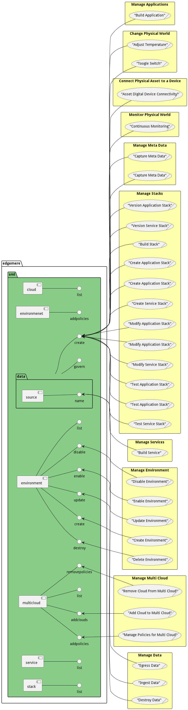
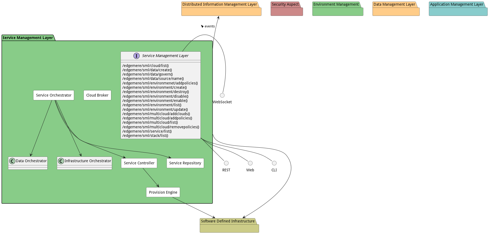
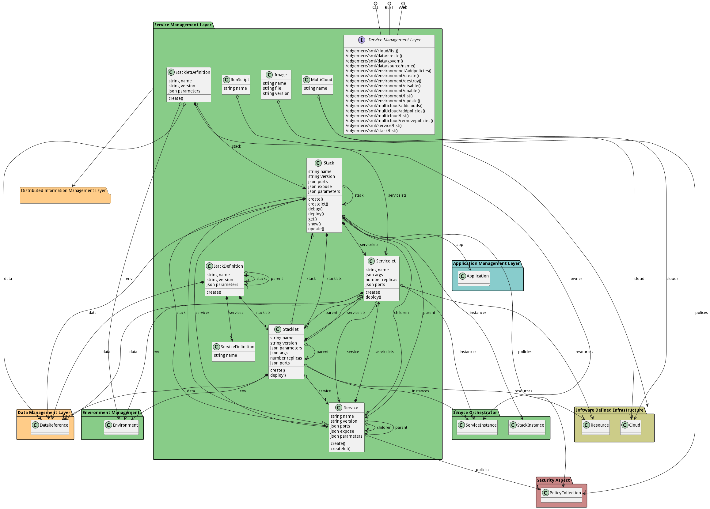

# Service Management Layer

Service Management Layer is a subsystem that manages services, stacks, environments, and multi-clouds.

The Service Management Layer (SML) is a middleware Layer in the architecture and is responsible for the orchestration
and management of services across multiple clouds, public, private and micro. The SML coordinates with
the [Distributed Information Management Layer](package--edgemere-diml) and
the [Software Defined Infrastructure](package--edgemere-sdi). It takes requests from
the [Application Management Layer](package--edgemere-aml) for deployment of services that make up applications and
workflows.

The main goal of the SML is to provide the [Application Developer](actor-applicationdeveloper) a simple, repeatable,
roboust mechanism to deploy services into the multi-cloud ecosystem. It also needs to provide
[IT Operations](actor-itops) mechanisms to enforce policies pertaining to cost, reliability and security. Applications
and Services are deployed to cloud assets based on these policies and can be run across cloud boundaries as dictated by
the IT policies enforced in the system. All communications between services should follow secure communication protocols
as dictated by the IT policies. The key is that a single portal or gateway should be used such that applications and
services are deployed and managed automatically with out human interaction. Decisions about where services should land
should be automatically based on the IT policies established not determined by
the [Application Developer](actor-applicationdeveloper) or [IT Operations Engineer](actor-itops).

The SML has has several actors that interact with the sub-system. Each one of these actors has a different motivator for
using the system. Eventhough some of their uses of the systems are the same. The reason they are using the system is
very different.

* [IT Operations](actor-itops) - Motivators include: optimize infrastructure for cost, protect infrastructure and IP,
  and increase reliability and resiliency.
* [DevOps Engineer](actor-devops) - Motivators include: Automate everything, streamlining code pipelining, managing
  build and deploy with CI/CD
* [Application Developer](actor-applicationdeveloper - Motivators include: Repeatable and reusable service stacks,
  deploying services across cloud and environments

* [Stack Developer](actor-stackdev) - Motivators include - Deliverying solutions in quick iterations, Very short break,
  fix, deploy cycle

The SML spaces is full of tools that can be integrated together to deliver the use cases demanded by the actors in this
space. The tools can be categorized into three major categories:

* Cloud Management Platforms - built for [IT Operations](actor-itops) focusing on multi-cloud support and management of
  infrastructure profiles across multi-clouds.
* Automation Frameworks - built for [DevOps](actor-devops) and [Stack Development](actor-stackdev) focusing on the
  provision and deployment of software in a repatable/reusable manner.
* Platform As A Service - built for [Application Developer](actor-applicationdeveloper) focusing on reusing services and
  decreasing the complexity of using those services to build applications.

These tool sets have been developed by and for specific actors over the years. And the integration of these tools
together help cover the current gaps that exist in the individual tools.

The SML has sub-systems as part of the architecture and include Orchestration and Control elements.

* [Environment Management](package--edgemere-sml-em) - manages environments (dev,test,prod) across multiple clouds
* [Service Orchestrator](package--edgemere-sml-so) - orchestrates the services in the different environments.
* [Service Registry](package--edgemere-sml-sr) - centralized repository of service definitions.
* [Data Coordinator](package--edgemere-dml-do) - working with the [DIML](package--edgemere-diml) to orchestrate data and
  services together.
* [Security](package--edgemere-sa) - working with the security policies and tools to ensure applications and services
  communicate securely.
* [Provision Enginer](package--edgemere-sml-pe) - provisions software stacks and services on infrastructure
* [Cloud Broker](package--edgemere-sml-cb) - manages the clouds and which clouds can manage which requests

## Use Cases

The following are the use cases of the Service Management Layer subsystem. Each use case has primary and secondary scenarios
that are elaborated in the use case descriptions.

* [Manage Clouds](usecase-ManageClouds)
* [Manage Services](usecase-ManageServices)

## Users

The following are the actors of the Service Management Layer subsystem. This can include people, other subsystems
inside the solution and even external subsystems.

* [ITOperations](actor-itops)
* [StackDeveloper](actor-stackdev)
* [ApplicationDeveloper](actor-applicationdeveloper)

## Interface

The subsystem has a REST, CLI, WebSocket, and Web interface. Use Cases and Scenarios can use any or all
of the interfaces to perform the work that needs to be completed. The following  diagram shows how
users interact with the system.

* [ edgemere sml cloud list](#action--edgemere-sml-cloud-list)
* [ edgemere sml data govern](#action--edgemere-sml-data-govern)
* [ edgemere sml data source name](#action--edgemere-sml-data-source-name)
* [ edgemere sml environmenet addpolicies](#action--edgemere-sml-environmenet-addpolicies)
* [ edgemere sml environment create](#action--edgemere-sml-environment-create)
* [ edgemere sml environment destroy](#action--edgemere-sml-environment-destroy)
* [ edgemere sml environment disable](#action--edgemere-sml-environment-disable)
* [ edgemere sml environment enable](#action--edgemere-sml-environment-enable)
* [ edgemere sml environment list](#action--edgemere-sml-environment-list)
* [ edgemere sml environment update](#action--edgemere-sml-environment-update)
* [ edgemere sml multicloud addclouds](#action--edgemere-sml-multicloud-addclouds)
* [ edgemere sml multicloud addpolicies](#action--edgemere-sml-multicloud-addpolicies)
* [ edgemere sml multicloud list](#action--edgemere-sml-multicloud-list)
* [ edgemere sml multicloud removepolicies](#action--edgemere-sml-multicloud-removepolicies)
* [ edgemere sml service list](#action--edgemere-sml-service-list)
* [ edgemere sml stack list](#action--edgemere-sml-stack-list)

## Logical Artifacts

The Data Model for the  Service Management Layer subsystem shows how the different objects and classes of object interact
and their structure.

### Sub Packages

The Service Management Layer subsystem has sub packages as well. These subsystems are logical components to better
organize the architecture and make it easier to analyze, understand, design, and implement.

* [Cloud Broker](package--edgemere-sml-cb)
* [Provision Engine](package--edgemere-sml-pe)
* [Service Controller](package--edgemere-sml-sc)
* [Service Orchestrator](package--edgemere-sml-so)
* [Service Repository](package--edgemere-sml-sr)

### Classes

The following are the classes in the data model of the Service Management Layer subsystem.

* [Image](class-Image)
* [MultiCloud](class-MultiCloud)
* [RunScript](class-RunScript)
* [Service](class-Service)
* [ServiceDefinition](class-ServiceDefinition)
* [Servicelet](class-Servicelet)
* [Stack](class-Stack)
* [StackDefinition](class-StackDefinition)
* [Stacklet](class-Stacklet)
* [StackletDefinition](class-StackletDefinition)

## Deployment Architecture

This subsystem is deployed using micro-services as shown in the diagram below. The 'micro' module is
used to implement the micro-services in the system. The subsystem also has an CLI, REST and Web Interface
exposed through a nodejs application. The nodejs application will interface with the micro-services and
can monitor and drive work-flows through the mesh of micro-services. The deployment of the subsystem is
dependent on the environment it is deployed. This subsystem has the following environments:
* [dev](environment--edgemere-sml-dev)
* [test](environment--edgemere-sml-test)
* [prod](environment--edgemere-sml-prod)

## Physical Architecture

The Service Management Layer subsystem is physically laid out on a hybrid cloud infrastructure. Each microservice belongs
to a secure micro-segmented network. All of the micro-services communicate to each other and the main app through a
REST interface. A Command Line Interface (CLI), REST or Web User interface for the app is how other subsystems or actors
interact. Requests are forwarded to micro-services through the REST interface of each micro-service. The subsystem has
the a unique layout based on the environment the physical space. The following are the environments for this
subsystems.
* [dev](environment--edgemere-sml-dev)
* [test](environment--edgemere-sml-test)
* [prod](environment--edgemere-sml-prod)

## Micro-Services

These are the micro-services for the subsystem. The combination of the micro-services help implement
the subsystem's logic.

### dev

Detail information for the [dev environment](environment--edgemere-sml-dev)
can be found [here](environment--edgemere-sml-dev)

Services in the dev environment

* frontend : sml_web
* gw : sml_gw

### test

Detail information for the [test environment](environment--edgemere-sml-test)
can be found [here](environment--edgemere-sml-test)

Services in the test environment

* frontend : sml_web
* gw : sml_gw

### prod

Detail information for the [prod environment](environment--edgemere-sml-prod)
can be found [here](environment--edgemere-sml-prod)

Services in the prod environment

* frontend : sml_web
* gw : sml_gw

## Activities and Flows
The Service Management Layer subsystem provides the following activities and flows that help satisfy the use
cases and scenarios of the subsystem.

### Messages Sent

| Event | Description | Emitter |
|-------|-------------|---------|
| image.create |  When an object of type Image is created. | Image
| image.destroy |  When an object of type Image is destroyed. | Image
| image.updated |  When an object of type Image has an attribute or association updated. | Image
| multicloud.create |  When an object of type MultiCloud is created. | MultiCloud
| multicloud.destroy |  When an object of type MultiCloud is destroyed. | MultiCloud
| multicloud.updated |  When an object of type MultiCloud has an attribute or association updated. | MultiCloud
| runscript.create |  When an object of type RunScript is created. | RunScript
| runscript.destroy |  When an object of type RunScript is destroyed. | RunScript
| runscript.updated |  When an object of type RunScript has an attribute or association updated. | RunScript
| service.create |  When an object of type Service is created. | Service
| service.destroy |  When an object of type Service is destroyed. | Service
| service.updated |  When an object of type Service has an attribute or association updated. | Service
| servicedefinition.create |  When an object of type ServiceDefinition is created. | ServiceDefinition
| servicedefinition.destroy |  When an object of type ServiceDefinition is destroyed. | ServiceDefinition
| servicedefinition.updated |  When an object of type ServiceDefinition has an attribute or association updated. | ServiceDefinition
| servicelet.create |  When an object of type Servicelet is created. | Servicelet
| servicelet.destroy |  When an object of type Servicelet is destroyed. | Servicelet
| servicelet.updated |  When an object of type Servicelet has an attribute or association updated. | Servicelet
| stack.create |  When an object of type Stack is created. | Stack
| stack.destroy |  When an object of type Stack is destroyed. | Stack
| stack.updated |  When an object of type Stack has an attribute or association updated. | Stack
| stackdefinition.create |  When an object of type StackDefinition is created. | StackDefinition
| stackdefinition.destroy |  When an object of type StackDefinition is destroyed. | StackDefinition
| stackdefinition.updated |  When an object of type StackDefinition has an attribute or association updated. | StackDefinition
| stacklet.create |  When an object of type Stacklet is created. | Stacklet
| stacklet.destroy |  When an object of type Stacklet is destroyed. | Stacklet
| stacklet.updated |  When an object of type Stacklet has an attribute or association updated. | Stacklet
| stackletdefinition.create |  When an object of type StackletDefinition is created. | StackletDefinition
| stackletdefinition.destroy |  When an object of type StackletDefinition is destroyed. | StackletDefinition
| stackletdefinition.updated |  When an object of type StackletDefinition has an attribute or association updated. | StackletDefinition

## Interface Details
The Service Management Layer subsystem has a well defined interface. This interface can be accessed using a
command line interface (CLI), REST interface, and Web user interface. This interface is how all other
subsystems and actors can access the system.

### Action  edgemere sml cloud list

* REST - /edgemere/sml/cloud/list?attr1=string
* bin -  edgemere sml cloud list --attr1 string
* js - .edgemere.sml.cloud.list({ attr1:string })

#### Description
Description of the action

#### Parameters

| Name | Type | Required | Description |
|---|---|---|---|
| attr1 | string |false | Description for the parameter |

### Action  edgemere sml data govern

* REST - /edgemere/sml/data/govern?attr1=string
* bin -  edgemere sml data govern --attr1 string
* js - .edgemere.sml.data.govern({ attr1:string })

#### Description
Description of the action

#### Parameters

| Name | Type | Required | Description |
|---|---|---|---|
| attr1 | string |false | Description for the parameter |

### Action  edgemere sml data source name

* REST - /edgemere/sml/data/source/name?attr1=string
* bin -  edgemere sml data source name --attr1 string
* js - .edgemere.sml.data.source.name({ attr1:string })

#### Description
Description of the action

#### Parameters

| Name | Type | Required | Description |
|---|---|---|---|
| attr1 | string |false | Description for the parameter |

### Action  edgemere sml environmenet addpolicies

* REST - /edgemere/sml/environmenet/addpolicies?attr1=string
* bin -  edgemere sml environmenet addpolicies --attr1 string
* js - .edgemere.sml.environmenet.addpolicies({ attr1:string })

#### Description
Description of the action

#### Parameters

| Name | Type | Required | Description |
|---|---|---|---|
| attr1 | string |false | Description for the parameter |

### Action  edgemere sml environment create

* REST - /edgemere/sml/environment/create?attr1=string
* bin -  edgemere sml environment create --attr1 string
* js - .edgemere.sml.environment.create({ attr1:string })

#### Description
Description of the action

#### Parameters

| Name | Type | Required | Description |
|---|---|---|---|
| attr1 | string |false | Description for the parameter |

### Action  edgemere sml environment destroy

* REST - /edgemere/sml/environment/destroy?attr1=string
* bin -  edgemere sml environment destroy --attr1 string
* js - .edgemere.sml.environment.destroy({ attr1:string })

#### Description
Description of the action

#### Parameters

| Name | Type | Required | Description |
|---|---|---|---|
| attr1 | string |false | Description for the parameter |

### Action  edgemere sml environment disable

* REST - /edgemere/sml/environment/disable?attr1=string
* bin -  edgemere sml environment disable --attr1 string
* js - .edgemere.sml.environment.disable({ attr1:string })

#### Description
Description of the action

#### Parameters

| Name | Type | Required | Description |
|---|---|---|---|
| attr1 | string |false | Description for the parameter |

### Action  edgemere sml environment enable

* REST - /edgemere/sml/environment/enable?attr1=string
* bin -  edgemere sml environment enable --attr1 string
* js - .edgemere.sml.environment.enable({ attr1:string })

#### Description
Description of the action

#### Parameters

| Name | Type | Required | Description |
|---|---|---|---|
| attr1 | string |false | Description for the parameter |

### Action  edgemere sml environment list

* REST - /edgemere/sml/environment/list?attr1=string
* bin -  edgemere sml environment list --attr1 string
* js - .edgemere.sml.environment.list({ attr1:string })

#### Description
Description of the action

#### Parameters

| Name | Type | Required | Description |
|---|---|---|---|
| attr1 | string |false | Description for the parameter |

### Action  edgemere sml environment update

* REST - /edgemere/sml/environment/update?attr1=string
* bin -  edgemere sml environment update --attr1 string
* js - .edgemere.sml.environment.update({ attr1:string })

#### Description
Description of the action

#### Parameters

| Name | Type | Required | Description |
|---|---|---|---|
| attr1 | string |false | Description for the parameter |

### Action  edgemere sml multicloud addclouds

* REST - /edgemere/sml/multicloud/addclouds?attr1=string
* bin -  edgemere sml multicloud addclouds --attr1 string
* js - .edgemere.sml.multicloud.addclouds({ attr1:string })

#### Description
Description of the action

#### Parameters

| Name | Type | Required | Description |
|---|---|---|---|
| attr1 | string |false | Description for the parameter |

### Action  edgemere sml multicloud addpolicies

* REST - /edgemere/sml/multicloud/addpolicies?attr1=string
* bin -  edgemere sml multicloud addpolicies --attr1 string
* js - .edgemere.sml.multicloud.addpolicies({ attr1:string })

#### Description
Description of the action

#### Parameters

| Name | Type | Required | Description |
|---|---|---|---|
| attr1 | string |false | Description for the parameter |

### Action  edgemere sml multicloud list

* REST - /edgemere/sml/multicloud/list?attr1=string
* bin -  edgemere sml multicloud list --attr1 string
* js - .edgemere.sml.multicloud.list({ attr1:string })

#### Description
Description of the action

#### Parameters

| Name | Type | Required | Description |
|---|---|---|---|
| attr1 | string |false | Description for the parameter |

### Action  edgemere sml multicloud removepolicies

* REST - /edgemere/sml/multicloud/removepolicies?attr1=string
* bin -  edgemere sml multicloud removepolicies --attr1 string
* js - .edgemere.sml.multicloud.removepolicies({ attr1:string })

#### Description
Description of the action

#### Parameters

| Name | Type | Required | Description |
|---|---|---|---|
| attr1 | string |false | Description for the parameter |

### Action  edgemere sml service list

* REST - /edgemere/sml/service/list?attr1=string
* bin -  edgemere sml service list --attr1 string
* js - .edgemere.sml.service.list({ attr1:string })

#### Description
Description of the action

#### Parameters

| Name | Type | Required | Description |
|---|---|---|---|
| attr1 | string |false | Description for the parameter |

### Action  edgemere sml stack list

* REST - /edgemere/sml/stack/list?attr1=string
* bin -  edgemere sml stack list --attr1 string
* js - .edgemere.sml.stack.list({ attr1:string })

#### Description
Description of the action

#### Parameters

| Name | Type | Required | Description |
|---|---|---|---|
| attr1 | string |false | Description for the parameter |

