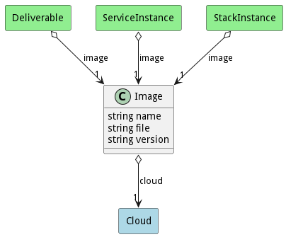

# Image

Image of the Service is a container that has all of the context to run a service

## Attributes

* name:string - Name of the image
* file:string - Physical file location of the image
* version:string - Version of the image

## Associations

| Name | Cardinality | Class | Composition | Owner | Description |
| --- | --- | --- | --- | --- | --- |
| cloud | 1 | Cloud | false | false |  |

## Users of the Model

| Name | Cardinality | Class | Composition | Owner | Description |
| --- | --- | --- | --- | --- | --- |
| image | 1 | Deliverable |  |  |  |
| image | 1 | ServiceInstance | false | false | Image of the service instance |
| image | 1 | StackInstance | false | false | Image of the service instance |

## Methods

<h2>Method Details</h2>
    

