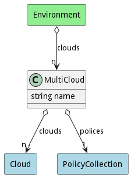

# MultiCloud

Multi Cloud is an aggregation of cloud tied together with policies that services are deployed.

## Attributes

* name:string - Name of the multicloud

## Associations

| Name | Cardinality | Class | Composition | Owner | Description |
| --- | --- | --- | --- | --- | --- |
| clouds | n | Cloud | false | false |  |
| polices | 1 | PolicyCollection | false | false |  |

## Users of the Model

| Name | Cardinality | Class | Composition | Owner | Description |
| --- | --- | --- | --- | --- | --- |
| clouds | n | Environment | false | false |  |

## Methods

<h2>Method Details</h2>
    

