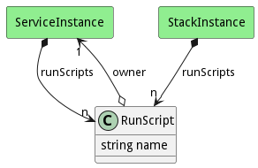

# RunScript

A RunScript is run when a service changes states. There are pre and post runscripts that can be run.

## Attributes

* name:string - Name of the runscript

## Associations

| Name | Cardinality | Class | Composition | Owner | Description |
| --- | --- | --- | --- | --- | --- |
| owner | 1 | ServiceInstance |  |  |  |

## Users of the Model

| Name | Cardinality | Class | Composition | Owner | Description |
| --- | --- | --- | --- | --- | --- |
| runScripts | n | ServiceInstance | true | true | Scripts to run for the different actions performed in the service |
| runScripts | n | ServiceInstance | true | true | Scripts to run for the different actions performed in the service |
| runScripts | n | ServiceInstance | true | true | Scripts to run for the different actions performed in the service |
| runScripts | n | ServiceInstance | true | true | Scripts to run for the different actions performed in the service |
| runScripts | n | ServiceInstance | true | true | Scripts to run for the different actions performed in the service |
| runScripts | n | ServiceInstance | true | true | Scripts to run for the different actions performed in the service |
| runScripts | n | ServiceInstance | true | true | Scripts to run for the different actions performed in the service |
| runScripts | n | ServiceInstance | true | true | Scripts to run for the different actions performed in the service |
| runScripts | n | ServiceInstance | true | true | Scripts to run for the different actions performed in the service |
| runScripts | n | ServiceInstance | true | true | Scripts to run for the different actions performed in the service |
| runScripts | n | ServiceInstance | true | true | Scripts to run for the different actions performed in the service |
| runScripts | n | ServiceInstance | true | true | Scripts to run for the different actions performed in the service |
| runScripts | n | ServiceInstance | true | true | Scripts to run for the different actions performed in the service |
| runScripts | n | ServiceInstance | true | true | Scripts to run for the different actions performed in the service |
| runScripts | n | ServiceInstance | true | true | Scripts to run for the different actions performed in the service |
| runScripts | n | ServiceInstance | true | true | Scripts to run for the different actions performed in the service |
| runScripts | n | ServiceInstance | true | true | Scripts to run for the different actions performed in the service |
| runScripts | n | ServiceInstance | true | true | Scripts to run for the different actions performed in the service |
| runScripts | n | ServiceInstance | true | true | Scripts to run for the different actions performed in the service |
| runScripts | n | ServiceInstance | true | true | Scripts to run for the different actions performed in the service |
| runScripts | n | ServiceInstance | true | true | Scripts to run for the different actions performed in the service |
| runScripts | n | ServiceInstance | true | true | Scripts to run for the different actions performed in the service |
| runScripts | n | ServiceInstance | true | true | Scripts to run for the different actions performed in the service |
| runScripts | n | ServiceInstance | true | true | Scripts to run for the different actions performed in the service |
| runScripts | n | ServiceInstance | true | true | Scripts to run for the different actions performed in the service |
| runScripts | n | ServiceInstance | true | true | Scripts to run for the different actions performed in the service |
| runScripts | n | ServiceInstance | true | true | Scripts to run for the different actions performed in the service |
| runScripts | n | ServiceInstance | true | true | Scripts to run for the different actions performed in the service |
| runScripts | n | ServiceInstance | true | true | Scripts to run for the different actions performed in the service |
| runScripts | n | ServiceInstance | true | true | Scripts to run for the different actions performed in the service |
| runScripts | n | ServiceInstance | true | true | Scripts to run for the different actions performed in the service |
| runScripts | n | ServiceInstance | true | true | Scripts to run for the different actions performed in the service |
| runScripts | n | ServiceInstance | true | true | Scripts to run for the different actions performed in the service |
| runScripts | n | ServiceInstance | true | true | Scripts to run for the different actions performed in the service |
| runScripts | n | ServiceInstance | true | true | Scripts to run for the different actions performed in the service |
| runScripts | n | ServiceInstance | true | true | Scripts to run for the different actions performed in the service |
| runScripts | n | ServiceInstance | true | true | Scripts to run for the different actions performed in the service |
| runScripts | n | ServiceInstance | true | true | Scripts to run for the different actions performed in the service |
| runScripts | n | StackInstance | true | true | Scripts to run for the different actions performed in the service |
| runScripts | n | ServiceInstance | true | true | Scripts to run for the different actions performed in the service |
| runScripts | n | StackInstance | true | true | Scripts to run for the different actions performed in the service |
| runScripts | n | ServiceInstance | true | true | Scripts to run for the different actions performed in the service |
| runScripts | n | StackInstance | true | true | Scripts to run for the different actions performed in the service |
| runScripts | n | ServiceInstance | true | true | Scripts to run for the different actions performed in the service |
| runScripts | n | StackInstance | true | true | Scripts to run for the different actions performed in the service |
| runScripts | n | ServiceInstance | true | true | Scripts to run for the different actions performed in the service |
| runScripts | n | StackInstance | true | true | Scripts to run for the different actions performed in the service |
| runScripts | n | ServiceInstance | true | true | Scripts to run for the different actions performed in the service |
| runScripts | n | StackInstance | true | true | Scripts to run for the different actions performed in the service |
| runScripts | n | ServiceInstance | true | true | Scripts to run for the different actions performed in the service |
| runScripts | n | StackInstance | true | true | Scripts to run for the different actions performed in the service |

## Methods

<h2>Method Details</h2>
    

