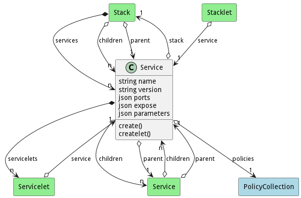

# Service

A Service is an orchestratable element that represents a container or vm running against a resource. The actual execution of the service is tracked by the ServiceInstance. A stack is made up of multiple services.

## Attributes

* name:string - Name of the Service
* version:string - Version of the Service
* ports:json - List of ports internally
* expose:json - List of ports to expose
* parameters:json - [ {name: value} ] - Lsit of parameters for the service

## Associations

| Name | Cardinality | Class | Composition | Owner | Description |
| --- | --- | --- | --- | --- | --- |
| stack | 1 | Stack | false | false | Parent Stack of the service |
| servicelets | n | Servicelet | true | true | Servicelets of the service (Environment) |
| children | n | Service | false | false | Child services of the service |
| parent | 1 | Service | false | false | Parent of the service |
| policies | 1 | PolicyCollection | false | false | Policies of the Service |

## Users of the Model

| Name | Cardinality | Class | Composition | Owner | Description |
| --- | --- | --- | --- | --- | --- |
| children | n | Service | false | false | Child services of the service |
| parent | 1 | Service | false | false | Parent of the service |
| service | 1 | Servicelet | false | false | Service for the servicelet, this is what service is run. This could be a service or a stack |
| services | n | Stack | true | true | Services of the stack |
| children | n | Stack | false | false | Child services of the service |
| parent | 1 | Stack | false | false | Parent of the service |
| service | 1 | Stacklet | false | false | Service for the servicelet, this is what service is run. This could be a service or a stack |

## Methods
* [create() - Create a Service](#action-create)
* [createlet() - Create a Stack](#action-createlet)

<h2>Method Details</h2>
    
### Action service create

* REST - service/create?
* bin - service create 
* js - service.create({  })

#### Description
Create a Service

#### Parameters

No parameters

### Action service createlet

* REST - service/createlet?
* bin - service createlet 
* js - service.createlet({  })

#### Description
Create a Stack

#### Parameters

No parameters

