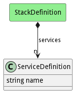

# ServiceDefinition

This represents the definition of a service to be used to create a service

## Attributes

* name:string - Name of the service definition

## Associations

No associations

## Users of the Model

| Name | Cardinality | Class | Composition | Owner | Description |
| --- | --- | --- | --- | --- | --- |
| services | n | StackDefinition | true | true | Services of the stack |

## Methods

<h2>Method Details</h2>
    

