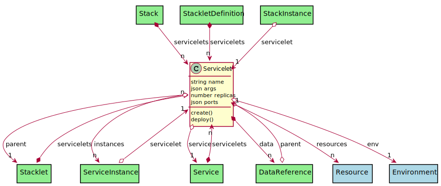

# Servicelet

Servicelet is the combination of a Service with the environment. This gives the ability to have  a service that behaves differently depending on the environment it resides.

## Attributes

* name:string - Name of the Servicelet
* args:json - Names Argument list [ {name: value} ]
* replicas:number - Number of replicas to run
* ports:json - Port Mappings ####:####

## Associations

| Name | Cardinality | Class | Composition | Owner | Description |
| --- | --- | --- | --- | --- | --- |
| resources | n | Resource | false | false | resource requests for the servicelet |
| parent | 1 | Stacklet | false | false | Parent stacklet for the servicelet |
| instances | n | ServiceInstance | false | false | ServiceInstance for the servicelet |
| service | 1 | Service | false | false | Service for the servicelet, this is what service is run. This could be a service or a stack |
| env | 1 | Environment | false | false | Environment for the Servicelet |
| data | n | DataReference | false | true | Data References to the data in the Stacklet |

## Users of the Model

| Name | Cardinality | Class | Composition | Owner | Description |
| --- | --- | --- | --- | --- | --- |
| parent | 1 | DataReference | false | false |  |
| servicelets | n | Service | true | true | Servicelets of the service (Environment) |
| servicelets | n | Stack | true | true | Servicelets of the service (Environment) |
| servicelets | n | Stacklet | true | true | Service with environment for the Stacklet |
| servicelets | n | StackletDefinition | true | true | Service with environment for the Stacklet |
| servicelet | 1 | ServiceInstance | false | false | Service and environment combined together that defines the service instance |
| servicelet | 1 | StackInstance | false | false | Service and environment combined together that defines the service instance |

## Methods

* [create() - Create a Stack](#action-create)

* [deploy() - Deploy a Servicelet](#action-deploy)

<h2>Method Details</h2>
    
### Action servicelet create

* REST - servicelet/create
* bin - servicelet create
* js - servicelet.create

Create a Stack

| Name | Type | Required | Description |
|---|---|---|---|

### Action servicelet deploy

* REST - servicelet/deploy
* bin - servicelet deploy
* js - servicelet.deploy

Deploy a Servicelet

| Name | Type | Required | Description |
|---|---|---|---|
| tag | string |false | Tag of the deployment of the stack. This is used to reference the deployed stack. |
| args | json |false | Arguments passed into the stack deployment |

