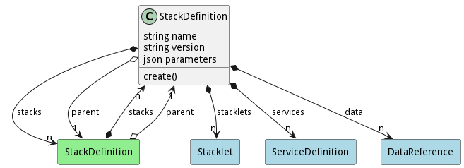

# StackDefinition

A Stack is an aggregation of services in one context. The Stack can have any number of Services and has a stacklet for each environment in the system. Application typically have 1 or more stacks to define their applications.

## Attributes

* name:string - Name of the stack
* version:string - Version of the stack
* parameters:json - Parameters of the stack [ {name:value} ]

## Associations

| Name | Cardinality | Class | Composition | Owner | Description |
| --- | --- | --- | --- | --- | --- |
| stacklets | n | Stacklet | true | true | Stacklets of the stack and environment |
| stacks | n | StackDefinition | true | true | Services of the stack |
| parent | 1 | StackDefinition |  |  | Services of the stack |
| services | n | ServiceDefinition | true | true | Services of the stack |
| data | n | DataReference | false | true | Data for the stack |

## Users of the Model

| Name | Cardinality | Class | Composition | Owner | Description |
| --- | --- | --- | --- | --- | --- |
| stacks | n | StackDefinition | true | true | Services of the stack |
| parent | 1 | StackDefinition |  |  | Services of the stack |

## Methods

* [create() - Create a Stack](#action-create)

<h2>Method Details</h2>
    
### Action stackdefinition create

* REST - stackdefinition/create?
* bin - stackdefinition create 
* js - stackdefinition.create({  })

#### Description
Create a Stack

#### Parameters

No parameters

