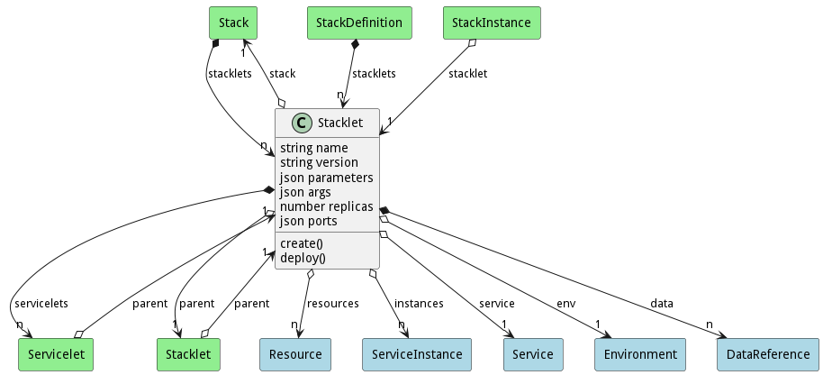

# Stacklet

This is a combination of the stack with a specific environment. This allows for a stack to behave differently depending on the envionrment it is in.

## Attributes

* name:string - Name of the Stacklet
* version:string - Name of the Stacklet
* parameters:json - Parameters for the stacklet [ {name:value }]
* args:json - Names Argument list [ {name: value} ]
* replicas:number - Number of replicas to run
* ports:json - Port Mappings ####:####

## Associations

| Name | Cardinality | Class | Composition | Owner | Description |
| --- | --- | --- | --- | --- | --- |
| stack | 1 | Stack | false | false | Parent Stack for the Stacklet |
| servicelets | n | Servicelet | true | true | Service with environment for the Stacklet |
| resources | n | Resource | false | false | resource requests for the servicelet |
| parent | 1 | Stacklet | false | false | Parent stacklet for the servicelet |
| instances | n | ServiceInstance | false | false | ServiceInstance for the servicelet |
| service | 1 | Service | false | false | Service for the servicelet, this is what service is run. This could be a service or a stack |
| env | 1 | Environment | false | false | Environment for the Servicelet |
| data | n | DataReference | false | true | Data References to the data in the Stacklet |

## Users of the Model

| Name | Cardinality | Class | Composition | Owner | Description |
| --- | --- | --- | --- | --- | --- |
| parent | 1 | Servicelet | false | false | Parent stacklet for the servicelet |
| stacklets | n | Stack | true | true | Stacklets of the stack and environment |
| stacklets | n | StackDefinition | true | true | Stacklets of the stack and environment |
| parent | 1 | Stacklet | false | false | Parent stacklet for the servicelet |
| stacklet | 1 | StackInstance | false | false | Stacklet of the instance running |

## Methods
* [create() - Create a Stack](#action-create)
* [deploy() - Deploy a Stack](#action-deploy)

<h2>Method Details</h2>
    
### Action stacklet create

* REST - stacklet/create?
* bin - stacklet create 
* js - stacklet.create({  })

#### Description
Create a Stack

#### Parameters

No parameters

### Action stacklet deploy

* REST - stacklet/deploy?tag=string&amp;env=string&amp;args=json
* bin - stacklet deploy --tag string --env string --args json
* js - stacklet.deploy({ tag:string,env:string,args:json })

#### Description
Deploy a Stack

#### Parameters

| Name | Type | Required | Description |
|---|---|---|---|
| tag | string |false | Tag of the deployment of the stack. This is used to reference the deployed stack. |
| env | string |false | Name of the deployment environment |
| args | json |false | Arguments passed into the stack deployment |

