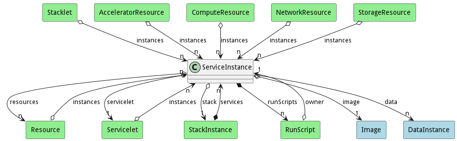

# ServiceInstance

This is an instance of a service running on resources. The Instance is allocated to resources based on the environment and policies of the Service and the Servicelet. A set of actions can be performed on the instance as defined by the runScripts association. 

## Attributes

## Associations

| Name | Cardinality | Class | Composition | Owner | Description |
| --- | --- | --- | --- | --- | --- |
| image | 1 | Image | false | false | Image of the service instance |
| data | n | DataInstance | false | false |  |
| resources | n | Resource | false | false | Resources used to host this service instance |
| servicelet | 1 | Servicelet | false | false | Service and environment combined together that defines the service instance |
| stack | 1 | StackInstance | false | false | StackInstance that is running the service instance |
| runScripts | n | RunScript | true | true | Scripts to run for the different actions performed in the service |

## Users of the Model

| Name | Cardinality | Class | Composition | Owner | Description |
| --- | --- | --- | --- | --- | --- |
| owner | 1 | RunScript |  |  |  |
| instances | n | Servicelet | false | false | ServiceInstance for the servicelet |
| services | n | StackInstance | true | true | Instances of the Services running in the Stack |
| instances | n | Resource | false | false |  |
| owner | 1 | RunScript |  |  |  |
| instances | n | Servicelet | false | false | ServiceInstance for the servicelet |
| services | n | StackInstance | true | true | Instances of the Services running in the Stack |
| instances | n | Resource | false | false |  |
| owner | 1 | RunScript |  |  |  |
| instances | n | Servicelet | false | false | ServiceInstance for the servicelet |
| services | n | StackInstance | true | true | Instances of the Services running in the Stack |
| instances | n | Resource | false | false |  |
| owner | 1 | RunScript |  |  |  |
| instances | n | Servicelet | false | false | ServiceInstance for the servicelet |
| services | n | StackInstance | true | true | Instances of the Services running in the Stack |
| instances | n | Resource | false | false |  |
| owner | 1 | RunScript |  |  |  |
| instances | n | Servicelet | false | false | ServiceInstance for the servicelet |
| services | n | StackInstance | true | true | Instances of the Services running in the Stack |
| instances | n | Resource | false | false |  |
| owner | 1 | RunScript |  |  |  |
| instances | n | Servicelet | false | false | ServiceInstance for the servicelet |
| services | n | StackInstance | true | true | Instances of the Services running in the Stack |
| instances | n | Resource | false | false |  |
| owner | 1 | RunScript |  |  |  |
| instances | n | Servicelet | false | false | ServiceInstance for the servicelet |
| services | n | StackInstance | true | true | Instances of the Services running in the Stack |
| instances | n | Resource | false | false |  |
| owner | 1 | RunScript |  |  |  |
| instances | n | Servicelet | false | false | ServiceInstance for the servicelet |
| services | n | StackInstance | true | true | Instances of the Services running in the Stack |
| instances | n | Resource | false | false |  |
| owner | 1 | RunScript |  |  |  |
| instances | n | Servicelet | false | false | ServiceInstance for the servicelet |
| services | n | StackInstance | true | true | Instances of the Services running in the Stack |
| instances | n | Resource | false | false |  |
| owner | 1 | RunScript |  |  |  |
| instances | n | Servicelet | false | false | ServiceInstance for the servicelet |
| services | n | StackInstance | true | true | Instances of the Services running in the Stack |
| instances | n | Resource | false | false |  |
| owner | 1 | RunScript |  |  |  |
| instances | n | Servicelet | false | false | ServiceInstance for the servicelet |
| services | n | StackInstance | true | true | Instances of the Services running in the Stack |
| instances | n | Resource | false | false |  |
| owner | 1 | RunScript |  |  |  |
| instances | n | Servicelet | false | false | ServiceInstance for the servicelet |
| services | n | StackInstance | true | true | Instances of the Services running in the Stack |
| instances | n | Resource | false | false |  |
| owner | 1 | RunScript |  |  |  |
| instances | n | Servicelet | false | false | ServiceInstance for the servicelet |
| services | n | StackInstance | true | true | Instances of the Services running in the Stack |
| instances | n | Resource | false | false |  |
| owner | 1 | RunScript |  |  |  |
| instances | n | Servicelet | false | false | ServiceInstance for the servicelet |
| services | n | StackInstance | true | true | Instances of the Services running in the Stack |
| instances | n | Resource | false | false |  |
| owner | 1 | RunScript |  |  |  |
| instances | n | Servicelet | false | false | ServiceInstance for the servicelet |
| services | n | StackInstance | true | true | Instances of the Services running in the Stack |
| instances | n | Resource | false | false |  |
| owner | 1 | RunScript |  |  |  |
| instances | n | Servicelet | false | false | ServiceInstance for the servicelet |
| services | n | StackInstance | true | true | Instances of the Services running in the Stack |
| instances | n | Resource | false | false |  |
| owner | 1 | RunScript |  |  |  |
| instances | n | Servicelet | false | false | ServiceInstance for the servicelet |
| services | n | StackInstance | true | true | Instances of the Services running in the Stack |
| instances | n | Resource | false | false |  |
| owner | 1 | RunScript |  |  |  |
| instances | n | Servicelet | false | false | ServiceInstance for the servicelet |
| services | n | StackInstance | true | true | Instances of the Services running in the Stack |
| instances | n | Resource | false | false |  |
| owner | 1 | RunScript |  |  |  |
| instances | n | Servicelet | false | false | ServiceInstance for the servicelet |
| services | n | StackInstance | true | true | Instances of the Services running in the Stack |
| instances | n | Resource | false | false |  |
| owner | 1 | RunScript |  |  |  |
| instances | n | Servicelet | false | false | ServiceInstance for the servicelet |
| services | n | StackInstance | true | true | Instances of the Services running in the Stack |
| instances | n | Resource | false | false |  |
| owner | 1 | RunScript |  |  |  |
| instances | n | Servicelet | false | false | ServiceInstance for the servicelet |
| services | n | StackInstance | true | true | Instances of the Services running in the Stack |
| instances | n | Resource | false | false |  |
| owner | 1 | RunScript |  |  |  |
| instances | n | Servicelet | false | false | ServiceInstance for the servicelet |
| services | n | StackInstance | true | true | Instances of the Services running in the Stack |
| instances | n | Resource | false | false |  |
| owner | 1 | RunScript |  |  |  |
| instances | n | Servicelet | false | false | ServiceInstance for the servicelet |
| services | n | StackInstance | true | true | Instances of the Services running in the Stack |
| instances | n | Resource | false | false |  |
| owner | 1 | RunScript |  |  |  |
| instances | n | Servicelet | false | false | ServiceInstance for the servicelet |
| services | n | StackInstance | true | true | Instances of the Services running in the Stack |
| instances | n | Resource | false | false |  |
| owner | 1 | RunScript |  |  |  |
| instances | n | Servicelet | false | false | ServiceInstance for the servicelet |
| services | n | StackInstance | true | true | Instances of the Services running in the Stack |
| instances | n | Resource | false | false |  |
| owner | 1 | RunScript |  |  |  |
| instances | n | Servicelet | false | false | ServiceInstance for the servicelet |
| services | n | StackInstance | true | true | Instances of the Services running in the Stack |
| instances | n | Resource | false | false |  |
| owner | 1 | RunScript |  |  |  |
| instances | n | Servicelet | false | false | ServiceInstance for the servicelet |
| services | n | StackInstance | true | true | Instances of the Services running in the Stack |
| instances | n | Resource | false | false |  |
| owner | 1 | RunScript |  |  |  |
| instances | n | Servicelet | false | false | ServiceInstance for the servicelet |
| services | n | StackInstance | true | true | Instances of the Services running in the Stack |
| instances | n | Resource | false | false |  |
| owner | 1 | RunScript |  |  |  |
| instances | n | Servicelet | false | false | ServiceInstance for the servicelet |
| services | n | StackInstance | true | true | Instances of the Services running in the Stack |
| instances | n | Resource | false | false |  |
| owner | 1 | RunScript |  |  |  |
| instances | n | Servicelet | false | false | ServiceInstance for the servicelet |
| services | n | StackInstance | true | true | Instances of the Services running in the Stack |
| instances | n | Resource | false | false |  |
| owner | 1 | RunScript |  |  |  |
| instances | n | Servicelet | false | false | ServiceInstance for the servicelet |
| services | n | StackInstance | true | true | Instances of the Services running in the Stack |
| instances | n | Resource | false | false |  |
| owner | 1 | RunScript |  |  |  |
| instances | n | Servicelet | false | false | ServiceInstance for the servicelet |
| services | n | StackInstance | true | true | Instances of the Services running in the Stack |
| instances | n | Resource | false | false |  |
| owner | 1 | RunScript |  |  |  |
| instances | n | Servicelet | false | false | ServiceInstance for the servicelet |
| services | n | StackInstance | true | true | Instances of the Services running in the Stack |
| instances | n | Resource | false | false |  |
| owner | 1 | RunScript |  |  |  |
| instances | n | Servicelet | false | false | ServiceInstance for the servicelet |
| services | n | StackInstance | true | true | Instances of the Services running in the Stack |
| instances | n | Resource | false | false |  |
| owner | 1 | RunScript |  |  |  |
| instances | n | Servicelet | false | false | ServiceInstance for the servicelet |
| services | n | StackInstance | true | true | Instances of the Services running in the Stack |
| instances | n | Resource | false | false |  |
| owner | 1 | RunScript |  |  |  |
| instances | n | Servicelet | false | false | ServiceInstance for the servicelet |
| services | n | StackInstance | true | true | Instances of the Services running in the Stack |
| instances | n | Resource | false | false |  |
| owner | 1 | RunScript |  |  |  |
| instances | n | Servicelet | false | false | ServiceInstance for the servicelet |
| services | n | StackInstance | true | true | Instances of the Services running in the Stack |
| instances | n | Resource | false | false |  |
| owner | 1 | RunScript |  |  |  |
| instances | n | Servicelet | false | false | ServiceInstance for the servicelet |
| services | n | StackInstance | true | true | Instances of the Services running in the Stack |
| instances | n | Resource | false | false |  |
| owner | 1 | RunScript |  |  |  |
| instances | n | Servicelet | false | false | ServiceInstance for the servicelet |
| services | n | StackInstance | true | true | Instances of the Services running in the Stack |
| instances | n | Resource | false | false |  |
| owner | 1 | RunScript |  |  |  |
| instances | n | Servicelet | false | false | ServiceInstance for the servicelet |
| instances | n | Stacklet | false | false | ServiceInstance for the servicelet |
| services | n | StackInstance | true | true | Instances of the Services running in the Stack |
| instances | n | Resource | false | false |  |
| owner | 1 | RunScript |  |  |  |
| instances | n | Servicelet | false | false | ServiceInstance for the servicelet |
| instances | n | Stacklet | false | false | ServiceInstance for the servicelet |
| services | n | StackInstance | true | true | Instances of the Services running in the Stack |
| instances | n | Resource | false | false |  |
| owner | 1 | RunScript |  |  |  |
| instances | n | Servicelet | false | false | ServiceInstance for the servicelet |
| instances | n | Stacklet | false | false | ServiceInstance for the servicelet |
| services | n | StackInstance | true | true | Instances of the Services running in the Stack |
| instances | n | AcceleratorResource | false | false |  |
| instances | n | ComputeResource | false | false |  |
| instances | n | NetworkResource | false | false |  |
| instances | n | Resource | false | false |  |
| instances | n | StorageResource | false | false |  |
| owner | 1 | RunScript |  |  |  |
| instances | n | Servicelet | false | false | ServiceInstance for the servicelet |
| instances | n | Stacklet | false | false | ServiceInstance for the servicelet |
| services | n | StackInstance | true | true | Instances of the Services running in the Stack |
| instances | n | AcceleratorResource | false | false |  |
| instances | n | ComputeResource | false | false |  |
| instances | n | NetworkResource | false | false |  |
| instances | n | Resource | false | false |  |
| instances | n | StorageResource | false | false |  |
| owner | 1 | RunScript |  |  |  |
| instances | n | Servicelet | false | false | ServiceInstance for the servicelet |
| instances | n | Stacklet | false | false | ServiceInstance for the servicelet |
| services | n | StackInstance | true | true | Instances of the Services running in the Stack |
| instances | n | AcceleratorResource | false | false |  |
| instances | n | ComputeResource | false | false |  |
| instances | n | NetworkResource | false | false |  |
| instances | n | Resource | false | false |  |
| instances | n | StorageResource | false | false |  |

## Methods

<h2>Method Details</h2>
    

