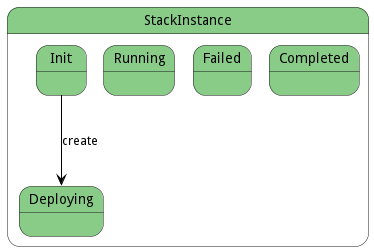

# StackInstance

The StackInstance is the execution of the Stack. This allows for control of the stack during execution.

## Attributes

* name:string - Name of the stackinstance

## Associations

| Name | Cardinality | Class | Composition | Owner | Description |
| --- | --- | --- | --- | --- | --- |
| app | 1 | ApplicationInstance | false | false | Application Instance of the stack instance |
| stack | 1 | Stack | false | false | Stack of the Stack Instance |
| stacklet | 1 | Stacklet | false | false | Stacklet of the instance running |
| services | n | ServiceInstance | true | true | Instances of the Services running in the Stack |
| image | 1 | Image | false | false | Image of the service instance |
| data | n | DataInstance | false | false |  |
| resources | n | Resource | false | false | Resources used to host this service instance |
| servicelet | 1 | Servicelet | false | false | Service and environment combined together that defines the service instance |
| runScripts | n | RunScript | true | true | Scripts to run for the different actions performed in the service |

## Users of the Model

| Name | Cardinality | Class | Composition | Owner | Description |
| --- | --- | --- | --- | --- | --- |
| instances | n | Stack | true | true | Instances of the stack |
| stack | 1 | ServiceInstance | false | false | StackInstance that is running the service instance |

## State Net
The StackInstance has a state net corresponding to instances of the class. Each state transistion will emit an 
event that can be caught with a websocket client. The name of the event is the name of the state in all lower case.
The following diagram is the state net for this class.

| Name | Description | Events |
| --- | --- | --- |
| Init | Initial State | create-&gt;Deploying,  |
| Deploying | Deploying the Stack Instance by provisioning all the resources and data for the services | requestData-&gt;undefined, requestResources-&gt;undefined,  |
| Running |  |  |
| Failed |  |  |
| Completed |  |  |

## Methods

<h2>Method Details</h2>
    

