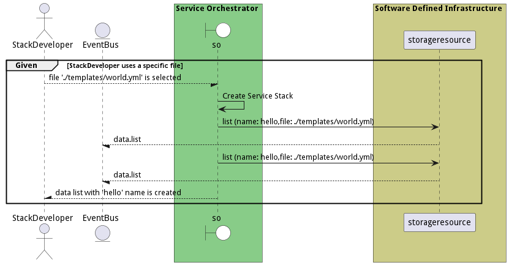
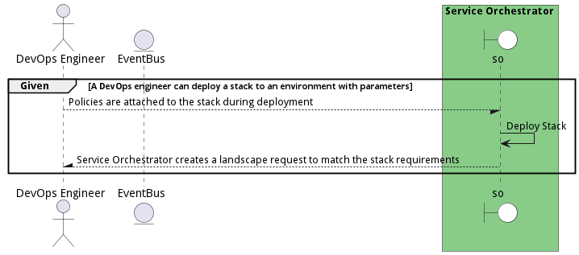
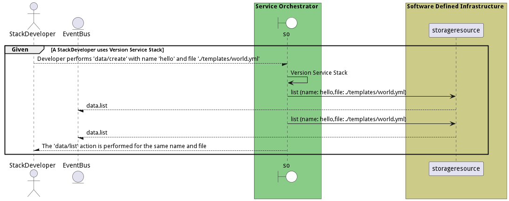

# Manage Stacks

Manage Stacks allows the stack developer to create, update, and delete stacks.

## Actors

* [Stack Developer](actor-stackdev)
* [Application Developer](actor-applicationdeveloper)

## Detail Scenarios

* [BuildStack](#scenario-BuildStack)
* [CreateApplicationStack](#scenario-CreateApplicationStack)
* [CreateServiceStack](#scenario-CreateServiceStack)
* [DeployStack](#scenario-DeployStack)
* [ModifyApplicationStack](#scenario-ModifyApplicationStack)
* [ModifyServiceStack](#scenario-ModifyServiceStack)
* [TestApplicationStack](#scenario-TestApplicationStack)
* [TestServiceStack](#scenario-TestServiceStack)
* [UninstallStack](#scenario-UninstallStack)
* [UpdateStack](#scenario-UpdateStack)
* [VersionApplicationStack](#scenario-VersionApplicationStack)
* [VersionServiceStack](#scenario-VersionServiceStack)

### Scenario Build Stack

Build Stack is the description

#### Steps
1. [data list --name hello --file ./templates/world.yml](#action-data-list)
1. [data list --name hello --file ./templates/world.yml](#action-data-list)

#### Actors

* [Actor](actor-actor)

### Scenario Create Application Stack

Create Application Stack is the description

#### Steps
1. [data list --name hello --file ./templates/world.yml](#action-data-list)
1. [data list --name hello --file ./templates/world.yml](#action-data-list)

#### Actors

* [Actor](actor-actor)

### Scenario Create Service Stack

Create Service Stack is the description

#### Steps
1. [data list --name hello --file ./templates/world.yml](#action-data-list)
1. [data list --name hello --file ./templates/world.yml](#action-data-list)

#### Actors

* [Actor](actor-actor)

### Scenario Deploy Stack

Deploy Stack allows a devops engineer to deploy a stack to an environment. Parameters can be passed during the deployment of the stack to the environment. Policies are attached to the stack during deployment and the stack is Service Orchestrator creates a landscape request to match the request of deploying the stack requirements.

#### Steps
1. To Be Defined

#### Actors

* [DevOps Engineer](actor-devops)

### Scenario Modify Application Stack

Modify Application Stack is the description

#### Steps
1. [data list --name hello --file ./templates/world.yml](#action-data-list)
1. [data list --name hello --file ./templates/world.yml](#action-data-list)

#### Actors

* [Actor](actor-actor)

### Scenario Modify Service Stack

Modify Service Stack is the description

#### Steps
1. [data list --name hello --file ./templates/world.yml](#action-data-list)
1. [data list --name hello --file ./templates/world.yml](#action-data-list)

#### Actors

* [Actor](actor-actor)

### Scenario Test Application Stack

Test Application Stack is the description

#### Steps
1. [data list --name hello --file ./templates/world.yml](#action-data-list)
1. [data list --name hello --file ./templates/world.yml](#action-data-list)

#### Actors

* [Actor](actor-actor)

### Scenario Test Service Stack

Test Service Stack is the description

#### Steps
1. [data list --name hello --file ./templates/world.yml](#action-data-list)
1. [data list --name hello --file ./templates/world.yml](#action-data-list)

#### Actors

* [Actor](actor-actor)

### Scenario Uninstall Stack

Uninstall Stack shuts down the stack and all of its services.

#### Steps
1. To Be Defined

#### Actors

* [DevOps Engineer](actor-devops)

### Scenario Update Stack

Update Stack allows the DevOps Engineer to update the stack after it has been deployed. This can include policies changes in the environment, updates to the stack definition, service definitions, or environmental changes.

#### Steps
1. To Be Defined

#### Actors

* [DevOps Engineer](actor-devops)

### Scenario Version Application Stack

Version Application Stack is the description

#### Steps
1. [data list --name hello --file ./templates/world.yml](#action-data-list)
1. [data list --name hello --file ./templates/world.yml](#action-data-list)

#### Actors

* [Actor](actor-actor)

### Scenario Version Service Stack

Version Service Stack is the description

#### Steps
1. [data list --name hello --file ./templates/world.yml](#action-data-list)
1. [data list --name hello --file ./templates/world.yml](#action-data-list)

#### Actors

* [Actor](actor-actor)

