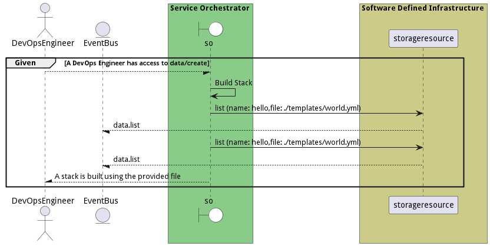
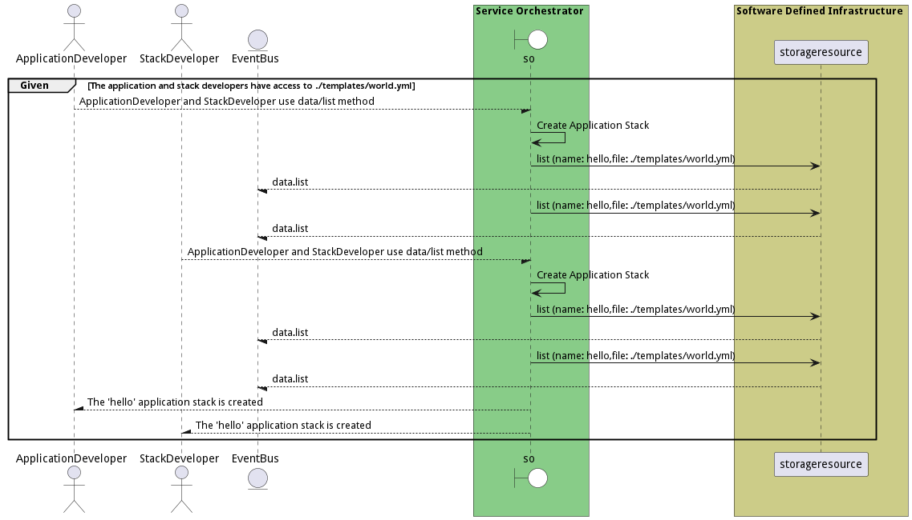
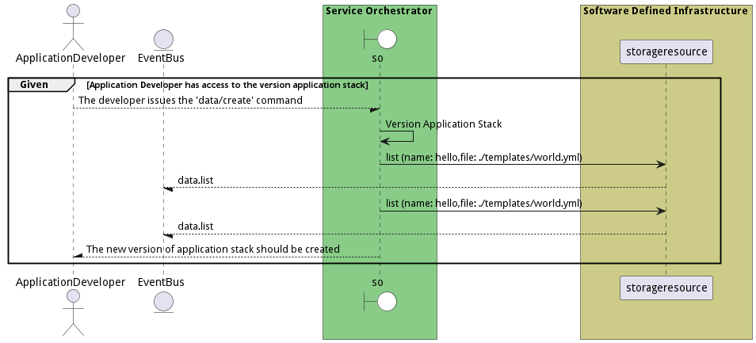

# Manage Stacks

Manage Stacks allows the stack developer to create, update, and delete stacks.

## Actors

* [Stack Developer](actor-stackdev)
* [Application Developer](actor-applicationdeveloper)

## Extends Use Cases

* [Control Virtual Infrastructure](usecase-ControlVirtualInfrastructure)

## Detail Scenarios

* [BuildStack](#scenario-BuildStack)
* [CreateApplicationStack](#scenario-CreateApplicationStack)
* [CreateServiceStack](#scenario-CreateServiceStack)
* [DeployStack](#scenario-DeployStack)
* [ModifyApplicationStack](#scenario-ModifyApplicationStack)
* [ModifyServiceStack](#scenario-ModifyServiceStack)
* [TestApplicationStack](#scenario-TestApplicationStack)
* [TestServiceStack](#scenario-TestServiceStack)
* [UninstallStack](#scenario-UninstallStack)
* [UpdateStack](#scenario-UpdateStack)
* [VersionApplicationStack](#scenario-VersionApplicationStack)
* [VersionServiceStack](#scenario-VersionServiceStack)

### Scenario Build Stack

Build Stack is the description

#### Criteria

* Given - A DevOps Engineer has access to data/create
* When - 
* Then - A DevOps Engineer has access to data/create

#### Steps
1. [data list --name hello --file ./templates/world.yml](#action-data-list)
1. [data list --name hello --file ./templates/world.yml](#action-data-list)

#### Actors

* [DevOps Engineer](actor-devops)

### Scenario Create Application Stack

Create Application Stack is the description

#### Criteria

* Given - The application and stack developers have access to ./templates/world.yml
* When - ApplicationDeveloper and StackDeveloper use data/list method
* Then - The application and stack developers have access to ./templates/world.yml

#### Steps
1. [data list --name hello --file ./templates/world.yml](#action-data-list)
1. [data list --name hello --file ./templates/world.yml](#action-data-list)

#### Actors

* [Application Developer](actor-applicationdeveloper)
* [Stack Developer](actor-stackdev)

### Scenario Create Service Stack

Create Service Stack is the description

#### Criteria

* Given - StackDeveloper uses a specific file
* When - file &#39;./templates/world.yml&#39; is selected
* Then - StackDeveloper uses a specific file

#### Steps
1. [data list --name hello --file ./templates/world.yml](#action-data-list)
1. [data list --name hello --file ./templates/world.yml](#action-data-list)

#### Actors

* [Stack Developer](actor-stackdev)

### Scenario Deploy Stack

Deploy Stack allows a devops engineer to deploy a stack to an environment. Parameters can be passed during the deployment of the stack to the environment. Policies are attached to the stack during deployment and the stack is Service Orchestrator creates a landscape request to match the request of deploying the stack requirements.

#### Criteria

* Given - A DevOps engineer can deploy a stack to an environment with parameters
* When - Policies are attached to the stack during deployment
* Then - A DevOps engineer can deploy a stack to an environment with parameters

#### Steps
1. To Be Defined

#### Actors

* [DevOps Engineer](actor-devops)

### Scenario Modify Application Stack

Modify Application Stack is the description

#### Criteria

* Given - A stack developer with access to current application stack
* When - The developer modifies the application stack
* Then - A stack developer with access to current application stack

#### Steps
1. [data list --name hello --file ./templates/world.yml](#action-data-list)
1. [data list --name hello --file ./templates/world.yml](#action-data-list)

#### Actors

* [Stack Developer](actor-stackdev)
* [Application Developer](actor-applicationdeveloper)

### Scenario Modify Service Stack

Modify Service Stack is the description

#### Criteria

* Given - A stack developer uses the &#39;Modify Service Stack&#39;
* When - The developer selects data by name &#39;hello&#39; from &#39;./templates/world.yml&#39;
* Then - A stack developer uses the &#39;Modify Service Stack&#39;

#### Steps
1. [data list --name hello --file ./templates/world.yml](#action-data-list)
1. [data list --name hello --file ./templates/world.yml](#action-data-list)

#### Actors

* [Stack Developer](actor-stackdev)

### Scenario Test Application Stack

Test Application Stack is the description

#### Criteria

* Given - The Test Application Stack is the description
* When - StackDeveloper and ApplicationDeveloper uses
* Then - The Test Application Stack is the description

#### Steps
1. [data list --name hello --file ./templates/world.yml](#action-data-list)
1. [data list --name hello --file ./templates/world.yml](#action-data-list)

#### Actors

* [Stack Developer](actor-stackdev)
* [Application Developer](actor-applicationdeveloper)

### Scenario Test Service Stack

Test Service Stack is the description

#### Criteria

* Given - Test Service Stack with StackDeveloper in use
* When - StackDeveloper runs data/list commands with specified parameters
* Then - Test Service Stack with StackDeveloper in use

#### Steps
1. [data list --name hello --file ./templates/world.yml](#action-data-list)
1. [data list --name hello --file ./templates/world.yml](#action-data-list)

#### Actors

* [Stack Developer](actor-stackdev)

### Scenario Uninstall Stack

Uninstall Stack shuts down the stack and all of its services.

#### Criteria

* Given - A DevOps Engineer has a running stack with services
* When - The Engineer decides to shut down the stack
* Then - A DevOps Engineer has a running stack with services

#### Steps
1. To Be Defined

#### Actors

* [DevOps Engineer](actor-devops)

### Scenario Update Stack

Update Stack allows the DevOps Engineer to update the stack after it has been deployed. This can include policies changes in the environment, updates to the stack definition, service definitions, or environmental changes.

#### Criteria

* Given - The DevOps Engineer uses the deployed stack
* When - Policy changes, updates to stack or service definitions, or environmental changes occur
* Then - The DevOps Engineer uses the deployed stack

#### Steps
1. To Be Defined

#### Actors

* [DevOps Engineer](actor-devops)

### Scenario Version Application Stack

Version Application Stack is the description

#### Criteria

* Given - Application Developer has access to the version application stack
* When - The developer issues the &#39;data/create&#39; command
* Then - Application Developer has access to the version application stack

#### Steps
1. [data list --name hello --file ./templates/world.yml](#action-data-list)
1. [data list --name hello --file ./templates/world.yml](#action-data-list)

#### Actors

* [Application Developer](actor-applicationdeveloper)

### Scenario Version Service Stack

Version Service Stack is the description

#### Criteria

* Given - A StackDeveloper uses Version Service Stack
* When - Developer performs &#39;data/create&#39; with name &#39;hello&#39; and file &#39;./templates/world.yml&#39;
* Then - A StackDeveloper uses Version Service Stack

#### Steps
1. [data list --name hello --file ./templates/world.yml](#action-data-list)
1. [data list --name hello --file ./templates/world.yml](#action-data-list)

#### Actors

* [Stack Developer](actor-stackdev)

