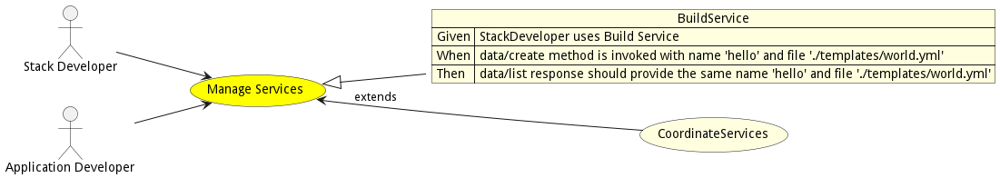
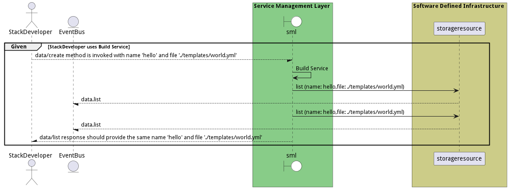

# Manage Services

Manage Services is the description

## Actors

* [Stack Developer](actor-stackdev)
* [Application Developer](actor-applicationdeveloper)

## Extends Use Cases

* [CoordinateServices](usecase-CoordinateServices)

## Detail Scenarios

* [BuildService](#scenario-BuildService)

### Scenario Build Service

Build Service is the description

#### Steps
1. [data list --name hello --file ./templates/world.yml](#action-data-list)
1. [data list --name hello --file ./templates/world.yml](#action-data-list)

#### Actors

* [Stack Developer](actor-stackdev)

