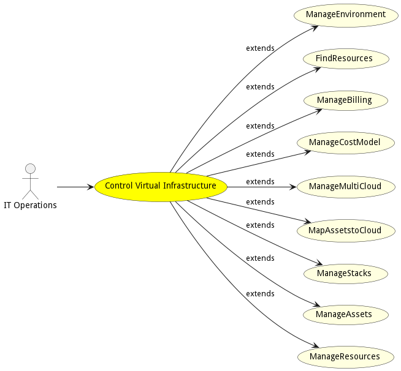

# Control Virtual Infrastructure

Control Virtual Infrastructure is the description

## Actors

* [IT Operations](actor-itops)

## Extended Use Cases

* [ManageEnvironment](usecase-ManageEnvironment)
* [FindResources](usecase-FindResources)
* [ManageBilling](usecase-ManageBilling)
* [ManageCostModel](usecase-ManageCostModel)
* [ManageMultiCloud](usecase-ManageMultiCloud)
* [MapAssetstoCloud](usecase-MapAssetstoCloud)
* [ManageStacks](usecase-ManageStacks)
* [ManageAssets](usecase-ManageAssets)
* [ManageResources](usecase-ManageResources)

## Detail Scenarios

