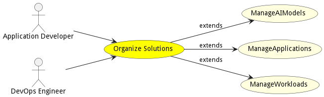

# Organize Solutions

Organize Solutions is the description

## Actors

* [Application Developer](actor-applicationdeveloper)
* [DevOps Engineer](actor-devops)

## Extended Use Cases

* [ManageAIModels](usecase-ManageAIModels)
* [ManageApplications](usecase-ManageApplications)
* [ManageWorkloads](usecase-ManageWorkloads)

## Detail Scenarios

