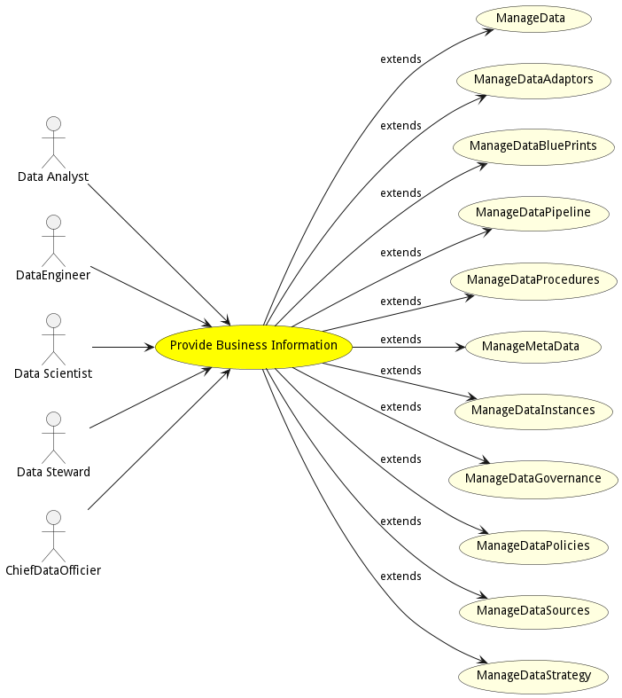

# Provide Business Information

Provide Business Information is the description

## Actors

* [Data Analyst](actor-analyst)
* [DataEngineer](actor-dataengineer)
* [Data Scientist](actor-datascientist)
* [Data Steward](actor-datasteward)
* [ChiefDataOfficier](actor-chiefdataofficier)

## Extended Use Cases

* [ManageData](usecase-ManageData)
* [ManageDataAdaptors](usecase-ManageDataAdaptors)
* [ManageDataBluePrints](usecase-ManageDataBluePrints)
* [ManageDataPipeline](usecase-ManageDataPipeline)
* [ManageDataProcedures](usecase-ManageDataProcedures)
* [ManageMetaData](usecase-ManageMetaData)
* [ManageDataInstances](usecase-ManageDataInstances)
* [ManageDataGovernance](usecase-ManageDataGovernance)
* [ManageDataPolicies](usecase-ManageDataPolicies)
* [ManageDataSources](usecase-ManageDataSources)
* [ManageDataStrategy](usecase-ManageDataStrategy)

## Detail Scenarios

