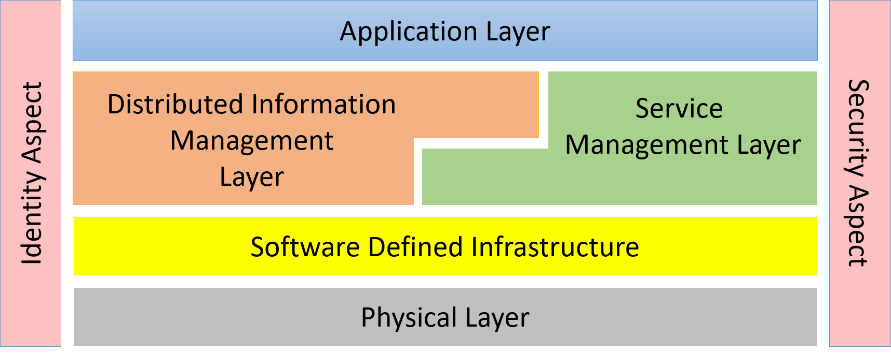
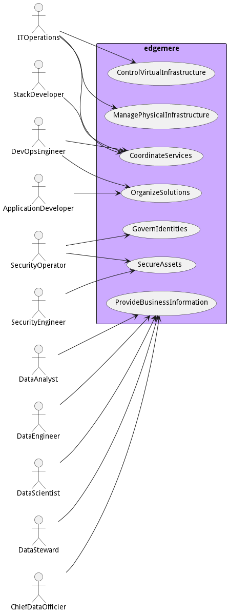
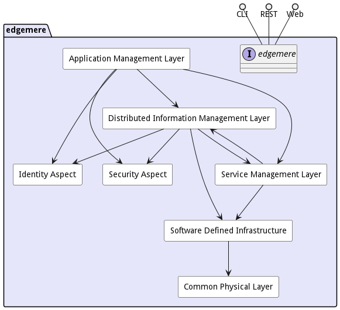

# edgemere

Edgemere is a conceptual architecture targeted to multi-hybrid cloud and edge computing strategies including data,
application, service, and infrastructure management. With the growth of IoT devices management of these elements from
edge to data center is important to the success of the solution.

In enable have a system that is future proof and expandable it is important to understand how different parts of the
system relate to each other and to establish isolation layers (through common interfaces or abstractions). This
isolation allows for the different subsystems in the solution to “grow” in parallel with minimal effect on the each
other. With the end goal in mind and the establishment of interfaces between the sub-systems new features for hardware
or software can be added progressively toward the utopian end state.

For detail information about micro-service architecture, use cases, and subsystems on [edgemere](package--edgemere)
click [here](package--edgemere).

This diagram shows how the different subsystems fit together. A quick understanding of each layer will expose the
responsibilities of each layer.

* [Application Layer](package--edgemere-aml) – Responsible for the management (development, test and deployment) of
  applications in the solution
* [Distributed Information Management Layer](package--edgemere-diml) – Responsible for the management (curation,
  governance, lifecycle management, and tagging) of data across a heterogeneous infrastructure (Cloud, Data Center, Edge
  and Client).
* [Service Management Layer](package--edgemere-sml) – Responsible for the deploying, monitoring, and provisioning of
  services (containers) in the solution.
* [Software Defined Infrastructure](package--edgemere-sdi) – Responsible for the management (deploying, monitoring and
  provisioning) of infrastructure (Compute, Storage, Network, and Accelerators) in the solution.
* [Physical Layer](package--edgemere-cpl) – Responsible for the command, control and monitoring of the physical devices
  in the solution.
* [Security Aspect](package--edgemere-sa) – Gives a common security model across the subsystems of the solution.
* [Identity Aspect](package--edgemere-ia) – Give the ability to uniquely identify and attest identity of users,
  hardware, applications, services, and virtual resources.

Many organizations have many of these subsystems already in their toolbox of solutions. Understand what you are
currently using and how those tools fit together and how they interface with each other is important. One of the goals
is to utilize the current tools as a foundation to build upon for the future end goal. A roadmap of technology and
process changes shows how the foundation can be built upon to achieve the long term architecture.

# edgemere Details

The following section contains details of the high level architecture of the edgemere system. It is broken
into the actors of the system, the use cases of the system, and a high level architecture of the system including
physical and deployment strategies. Details of these elements can be found by following the links to the complete
architecture.

## Actors

There are several users of the system. We first took a use case analysis approach to the architecture. First,
identifying the actors/users of the system and building out how the actor uses the system? What their key objectives and
goals are? and How they use the system? This list is not an exhaustive list of all actors of the system but are the
primary actors.

* [Actor](actor-actor) - The Actor is a fundamental interface that modifies, controls, and monitors physical entities in the system, primarily facilitating changes in the physical world, handling commissioning and decommissioning of assets, establishing connections between assets and devices, ensuring the security and management of these assets, and enabling continuous monitoring, bound within specific use cases and scenarios.
* [ApplicationDeveloper](actor-applicationdeveloper) - The Application Developer is responsible for defining, managing, deploying, and updating applications, AI models and workloads, as well as monitoring the performance of applications, using coordination with DevOps through the development pipeline.
* [ChiefDataOfficer](actor-chiefdataofficer) - The Chief Data Officer (CDO) is responsible for managing data procedures, data governance, data policies, and the overall data strategy within a business or organization.
* [ChiefDataOfficier](actor-chiefdataofficier) - Long description
* [DataAnalyst](actor-analyst) - Uses Data solutions produced by the Data Scientist and Data Engineer to provide business value to the organization.
* [DataEngineer](actor-dataengineer) - Responsible for operationalization of data pipeline and the automation and deployment of data solutions. They work closely with the Data Scientist to deliver solutions to data analyst.
* [DataScientist](actor-datascientist) - Responsible for the architecture and development of data analytic models and solutions. They work closely with the Data engineer to deliver solutions to the Data Analyst.
* [DataSteward](actor-datasteward) - Responsible for the governance of data in their organization. They implement policies established by the CDO.
* [Developer](actor-developer) - Long description
* [DevOpsEngineer](actor-devops) - Responsible for the management of the automation of the delivery of applications and solutions in the organization.
* [ITOperations](actor-itops) - Responsible for the management of the infrastructure.
* [SecurityEngineer](actor-securityengineer) - Long description
* [SecurityOperator](actor-securityoperator) - Long description
* [StackDeveloper](actor-stackdev) - Responsible for developing reusable micro-services and application stacks in the organization.
* [SystemAdministrator](actor-systemadministrator) - Long description

These actors are found in most organizations and there are several organizational structures that can be employed. The
key is to identify the people or organization that fits the different actors in the systems. The following is an example
of a centralized organizational structure of the actors of the system.

## UseCases

* [Control Virtual Infrastructure](usecase-ControlVirtualInfrastructure) - Control Virtual Infrastructure is the description
* [Coordinate Services](usecase-CoordinateServices) - Coordinate Services is the description
* [Govern Identities](usecase-GovernIdentities) - Govern Identities is the description
* [Manage Physical Infrastructure](usecase-ManagePhysicalInfrastructure) - Manage Physical Infrastructure is the description
* [Organize Solutions](usecase-OrganizeSolutions) - Organize Solutions is the description
* [Provide Business Information](usecase-ProvideBusinessInformation) - Provide Business Information is the description
* [Secure Assets](usecase-SecureAssets) - Secure Assets is the description

## Solution Architecture

The Data Model for the  edgemere shows how the different objects and classes of object interact and their
structure.
* [Application Management Layer](package--edgemere-aml) -
The Application Management Layer (AML) is a comprehensive package that provides classes and workflows for managing AI models, applications and workloads, facilitating interaction between various IT professionals such as DevOps Engineers, Application Developers, Data Engineers, and Data Scientists.
* [Common Physical Layer](package--edgemere-cpl) -
Common Physical Layer is a package that contains...
* [Distributed Information Management Layer](package--edgemere-diml) -
Distributed Information Management Layer is a package that contains...
* [Identity Aspect](package--edgemere-ia) -
Identity Aspect is a package that contains...
* [Security Aspect](package--edgemere-sa) -
Security Aspect contains security tools and subsystems that are used throughout the architecture.
* [Service Management Layer](package--edgemere-sml) -
Service Management Layer is a subsystem that manages services, stacks, environments, and multi-clouds.
* [Software Defined Infrastructure](package--edgemere-sdi) -
Software Defined Infrastructure(SDI) contains the abstractions for private and public clouds. The SDI layer is a common standard interface for all cloud resources both virutal, container, and bare metal.

### Deployment Architecture

This subsystem is deployed using microservices as shown in the diagram below. A nodejs app is used to implement the
microservices in the system. Each subsystem also has an CLI, REST and Web Interface exposed through a nodejs
application. Additionally, the subsystems handle events through a WebSocket interface. The nodejs application will
interface with the microservices and can monitor and drive work-flows through the mesh of microservices.

The solution can be deployed on different environments. The standard environments in the architecture are local, dev,
test, and prod. These environments fit into the typical devops pipelines that exist in the industry. Additional
deployment environments can be added to fit the needs of the user.

* [local](environment--edgemere-local)
* [dev](environment--edgemere-dev)
* [test](environment--edgemere-test)
* [prod](environment--edgemere-prod)

### Physical Architecture

The edgemere architecture is physically laid out on a hybrid cloud infrastructure using a microservice
architecture. All the microservices communicate to each other and the administrative app through a REST and Websocket
interface. A CLI, REST, Websocket and Web interface is available for external systems or users to interact with the
system. Each subsystem in the architecture uses an aggregated service/stack pattern that allows for the elasticity of
services based on the workloads, capacity and business rules established for the solution. See each subsystem for more
information on the individual stacks and their services.

* [local](environment--edgemere-local)
* [dev](environment--edgemere-dev)
* [test](environment--edgemere-test)
* [prod](environment--edgemere-prod)
