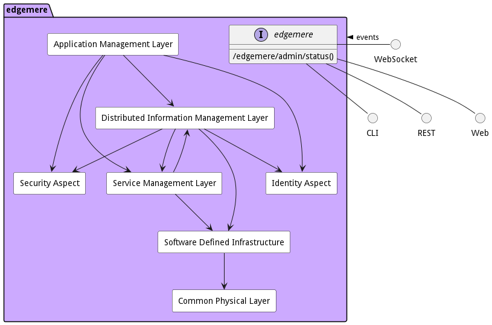

{# topPackage.name.toLowerCase()-project}

# edgemere

Edgemere is a conceptual architecture targeted to multi-hybrid cloud and edge computing strategies including data,
application, service, and infrastructure management. With the growth of IoT devices management of these elements from
edge to data center is important to the success of the solution.

In enable have a system that is future proof and expandable it is important to understand how different parts of the
system relate to each other and to establish isolation layers (through common interfaces or abstractions). This
isolation allows for the different subsystems in the solution to “grow” in parallel with minimal effect on the each
other. With the end goal in mind and the establishment of interfaces between the sub-systems new features for hardware
or software can be added progressively toward the utopian end state.

For detail information about micro-service architecture, use cases, and subsystems on [edgemere](package--edgemere)
click [here](package--edgemere).

This diagram shows how the different subsystems fit together. A quick understanding of each layer will expose the
responsibilities of each layer.

* [Application Layer](package--edgemere-aml) – Responsible for the management (development, test and deployment) of
  applications in the solution
* [Distributed Information Management Layer](package--edgemere-diml) – Responsible for the management (curation,
  governance, lifecycle management, and tagging) of data across a heterogeneous infrastructure (Cloud, Data Center, Edge
  and Client).
* [Service Management Layer](package--edgemere-sml) – Responsible for the deploying, monitoring, and provisioning of
  services (containers) in the solution.
* [Software Defined Infrastructure](package--edgemere-sdi) – Responsible for the management (deploying, monitoring and
  provisioning) of infrastructure (Compute, Storage, Network, and Accelerators) in the solution.
* [Physical Layer](package--edgemere-cpl) – Responsible for the command, control and monitoring of the physical devices
  in the solution.
* [Security Aspect](package--edgemere-sa) – Gives a common security model across the subsystems of the solution.
* [Identity Aspect](package--edgemere-ia) – Give the ability to uniquely identify and attest identity of users,
  hardware, applications, services, and virtual resources.

Many organizations have many of these subsystems already in their toolbox of solutions. Understand what you are
currently using and how those tools fit together and how they interface with each other is important. One of the goals
is to utilize the current tools as a foundation to build upon for the future end goal. A roadmap of technology and
process changes shows how the foundation can be built upon to achieve the long term architecture.

# Actors

There are several users of the system. We first took a use case analysis approach to the architecture. First,
identifying the actors/users of the system and building out how the actor uses the system? What their key objectives and
goals are? and How they use the system? This list is not an exhaustive list of all actors of the system but are the
primary actors.

* [Actor](actor-actor)
  
* [ApplicationDeveloper](actor-applicationdeveloper)
  
* [ChiefDataOfficer](actor-cdo)
  
* [DataAnalyst](actor-analyst)
  
* [DataEngineer](actor-dataengineer)
  
* [DataScientist](actor-datascientist)
  
* [DataSteward](actor-datasteward)
  
* [DevOpsEngineer](actor-devops)
  
* [ITOperations](actor-itops)
  
* [StackDeveloper](actor-stackdev)
  

These actors are found in most organizations and there are several different organizational structures that can be
employed. The key is to identify the people or organization that fits the different actors in the systems. The following
is an example of a centralized organizational structure of the actors of the system.

# UseCases

* [Manage Environment](usecase-ManageEnvironment)
  
* [Manage AI Models](usecase-ManageAIModels)
  
* [Manage Applications](usecase-ManageApplications)
  
* [Manage Workloads](usecase-ManageWorkloads)
  
* [Manage Data Center](usecase-ManageDataCenter)
  
* [Manage Infrastructure](usecase-ManageInfrastructure)
  
* [Manage Data](usecase-ManageData)
  
* [Manage Data Adaptors](usecase-ManageDataAdaptors)
  
* [Manage Data Blue Prints](usecase-ManageDataBluePrints)
  
* [Manage Data Pipeline](usecase-ManageDataPipeline)
  
* [Manage Data Procedures](usecase-ManageDataProcedures)
  
* [Manage Meta Data](usecase-ManageMetaData)
  
* [Manage Data Instances](usecase-ManageDataInstances)
  
* [Manage Data Governance](usecase-ManageDataGovernance)
  
* [Manage Data Policies](usecase-ManageDataPolicies)
  
* [Manage Data Sources](usecase-ManageDataSources)
  
* [Manage Data Strategy](usecase-ManageDataStrategy)
  
* [Apply Security Profiles](usecase-ApplySecurityProfiles)
  
* [Manage Security Profiles](usecase-ManageSecurityProfiles)
  
* [Find Resources](usecase-FindResources)
  
* [ManageBilling](usecase-ManageBilling)
  
* [ManageCostModel](usecase-ManageCostModel)
  
* [Manage Multi Cloud](usecase-ManageMultiCloud)
  
* [Map Assets to Cloud](usecase-MapAssetstoCloud)
  
* [Map Services to Resources](usecase-MapServicestoResources)
  
* [Manage Stacks](usecase-ManageStacks)
  
* [Manage Assets](usecase-ManageAssets)
  
* [Manage Clouds](usecase-ManageClouds)
  
* [Manage Services](usecase-ManageServices)
  
* [Manage Resources](usecase-ManageResources)
  

# Solution Architecture

The Data Model for the  edgemere shows how the different objects and classes of object interact and their
structure.

* [Application Management Layer](package--edgemere-aml)
  
* [Common Physical Layer](package--edgemere-cpl)
  
* [Distributed Information Management Layer](package--edgemere-diml)
  
* [Identity Aspect](package--edgemere-ia)
  
* [Security Aspect](package--edgemere-sa)
  
* [Service Management Layer](package--edgemere-sml)
  
* [Software Defined Infrastructure](package--edgemere-sdi)
  

## Deployment Architecture

This subsystem is deployed using micro-services as shown in the diagram below. A nodejs app is used to implement the
micro-services in the system. Each subsystem also has an CLI, REST and Web Interface exposed through a nodejs
application. The nodejs application will interface with the micro-services and can monitor and drive work-flows through
the mesh of micro-services.

The solution can be deployed on different environments. The standard environments in the architecture are local, dev,
test, and prod. These environments fit into the typical devops pipelines that exist in the industry. Additional
deployment environments can be added to fit the needs of the user.

## Physical Architecture

The edgemere architecture is physically laid out on a hybrid cloud infrastructure using a microservice
architecture. All of the micro-services communicate to each other and the main app through a REST interface. A CLI, REST
or Web interface is available for external systems or users to interact with the system. Each subsystem in the
architecture uses an aggregated service/stack pattern that allows for the elasticity of services based on the workloads,
capacity and business rules established for the solution. See each subsytem for more information on the individual
stacks and their services.

## Deployment Architecture

This subsystem is deployed using micro-services as shown in the diagram below. The 'micro' module is used to implement
the micro-services in the system. The subsystem also has an CLI, REST and Web Interface exposed through a nodejs
application. The nodejs application will interface with the micro-services and can monitor and drive work-flows through
the mesh of micro-services.

