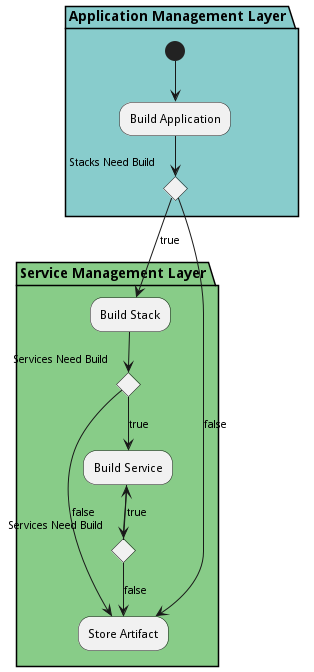

# Application Build Process

The &#39;Application Build Process&#39; begins with an application developer in the initial state. The developer enters the build application stage addressed by the package &#39;Application Management Layer&#39;. The Application may need its stack built or the artifact stored depending on conditions. The building of the stack is handled by the &#39;Service Management Layer&#39; package, similarly with the micro-service build. Finally, the artifact is stored marking the end of the workflow.

## Activities

* Init - Initial state for the workflow
* [Build Application](scenario-BuildApplication) - Build the application and all of its dependencies
* [Build Stack](scenario-BuildStack) - Build a stack of services and all of its dependencies
* [Build Service](scenario-BuildService) - Build a micro-services as a container image.
* Store Artifact - Store Artifact in the Repository

### Init

Initial state for the workflow

*Actor* - Application Developer

#### Next Activities

* Build Application 

### Build Application

Build the application and all of its dependencies

*Type* - scenario

*Package* - Application Management Layer

#### Next Activities

* Build Stack  [ Stacks Need Build === true ] 
* Store Artifact  [ Stacks Need Build === false ] 

### Build Stack

Build a stack of services and all of its dependencies

*Type* - scenario

*Package* - Service Management Layer

#### Next Activities

* Build Service  [ Services Need Build === true ] 
* Store Artifact  [ Services Need Build === false ] 

### Build Service

Build a micro-services as a container image.

*Type* - scenario

*Package* - Service Management Layer

#### Next Activities

* Build Service  [ Services Need Build === true ] 
* Store Artifact  [ Services Need Build === false ] 

### Store Artifact

Store Artifact in the Repository

*Package* - Service Management Layer

