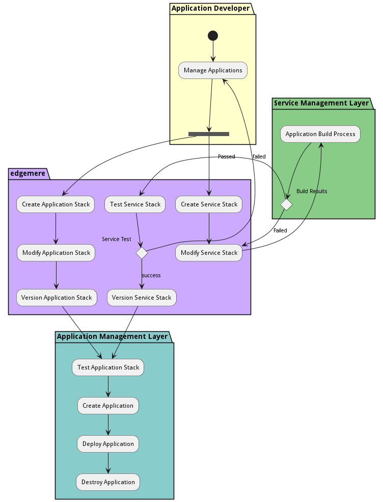

# Application Development Process

Application Developer process for common development.

## Activities

* Init - Initial state for the workflow
* [Manage Applications](usecase-ManageApplications) - Write code
* [Create Application Stack](scenario-CreateApplicationStack) - Create an application stack
* [Modify Application Stack](scenario-ModifyApplicationStack) - Create an application stack
* [Version Application Stack](scenario-VersionApplicationStack) - Version an application stack
* [Create Service Stack](scenario-CreateServiceStack) - Create an application stack
* [Modify Service Stack](scenario-ModifyServiceStack) - Create an application stack
* [Application Build Process](workflow-ApplicationBuildProcess) - Run the code through the build process
* [Test Service Stack](scenario-TestServiceStack) - Test the service stack in an environment
* [Version Service Stack](scenario-VersionServiceStack) - Version an application stack
* [Test Application Stack](scenario-TestApplicationStack) - Test an application stack
* [Create Application](scenario-CreateApplication) - Create an application from the stack
* [Deploy Application](scenario-DeployApplication) - Launch an application in an environment
* [Destroy Application](scenario-DestroyApplication) - Destroy Application
