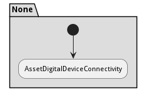
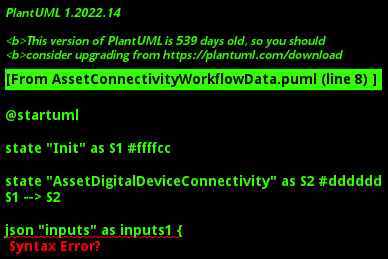

# Asset Connectivity Workflow

Physical assets need to be monitored and controlled. They are connected to a digital device to collect telemetry data and issue controls to the physical asset. This workflow starts by attesting the physical asset with the digital device to make sure that both trust each other in the security profiles they are operating in. Then, they check for the communication protocol they are communicating, and then they establish a communication pathway.

## Activities

* Init - Start connectivity process
* [AssetDigitalDeviceConnectivity](scenario-AssetDigitalDeviceConnectivity) - 

### Init

Start connectivity process

*Package* - PhysicalWorld

*Actor* - Actor

#### Inputs

* asset : ref - The asset to be connected
* device : ref - The device to be connected to
#### Outputs

* status :  - Connected status of the device

#### Next Activities

* AssetDigitalDeviceConnectivity 

### AssetDigitalDeviceConnectivity

*Type* - scenario

#### Inputs

* asset : ref - Physical asset
* device : ref - Digital device
