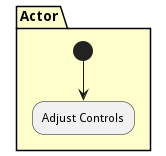
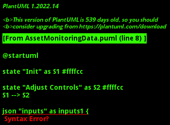

# Asset Monitoring

The &#39;Asset Monitoring&#39; workflow is designed to facilitate real-time monitoring and control of a physical asset. It begins with the initiation of real-time monitoring for a specific physical asset, followed by necessary adjustments to the asset&#39;s controls based on monitoring feedback.

1. A System Admin connects the physical asset to a digital device that can collect telemetry from the asset.
2. A set of threshold values are used to send alerts if the physical asset telemetry values are out of the range of the threshold.
3. The device is monitored for those QoS values and alerts are thrown if it goes beyond the QoS.
4. Periodic status is polled from the physical asset to make sure it is still operating as expected.

## Activities

* Init - Start monitoring of a particular physical asset.
* Adjust Controls - Allows the actor to adjust controls of the physical asset based on the monitoring feedback.

### Init

Start monitoring of a particular physical asset.

*Package* - Monitor Physical World

*Actor* - Actor

#### Inputs

* asset : string - Name or ID of the physical asset to be monitored
#### Outputs

#### Next Activities

* Adjust Controls 

### Adjust Controls

Allows the actor to adjust controls of the physical asset based on the monitoring feedback.

*Package* - Change Physical World

*Actor* - Actor

#### Inputs

* asset : string - Name or ID of the physical asset being controlled
#### Outputs

* result :  - A status message indicating if the control adjustment was successful.

#### Next Activities

