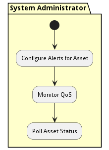

# Develop application Process

This process describes how t odevelop an application in the Edgemere system

## Activities

* Init - Initial state for the workflow
* [Create Application](scenario-CreateApplication) - Create an application to be developed in the edgemere architecture
* Write Code - The Application Developer Write Codes for the application
* Check In Code - The Application Developer Checks Code into the Repository
* [Application Build Process](workflow-ApplicationBuildProcess) - Process to build and test the application
* [Deploy Application](scenario-DeployApplication) - Deploy Application to the Production Environment
