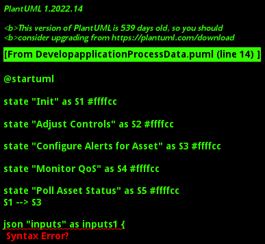

# Develop application Process

This workflow describes the development process of an application from the initial state to the deployment using the Edgemere system. The process includes the creation of the application in the Edgemere environment, the development of codes by the Application Developer, the process of checking the codes into the Repository, and the build testing phase. If the build test is passed, the application is deployed to the production environment by the DevOps Engineer.

## Activities

* Init - Start monitoring of a particular physical asset.
* Adjust Controls - Allows the actor to adjust controls of the physical asset based on the monitoring feedback.
* Configure Alerts for Asset - Set up alerts for the asset using threshold values for telemetry.
* Monitor QoS - Monitor the Quality of Service (QoS) values for the asset and trigger alerts when they exceed thresholds.
* Poll Asset Status - Periodically check the status of the physical asset to ensure it is operating as expected.

### Init

Start monitoring of a particular physical asset.

*Actor* - System Admininstrator

#### Inputs

* asset : string - Name or ID of the physical asset to be monitored
#### Outputs

#### Next Activities

* Configure Alerts for Asset 

### Adjust Controls

Allows the actor to adjust controls of the physical asset based on the monitoring feedback.

*Package* - Change Physical World

*Actor* - Actor

#### Inputs

* asset : string - Name or ID of the physical asset being controlled
#### Outputs

* result :  - A status message indicating if the control adjustment was successful.

#### Next Activities

### Configure Alerts for Asset

Set up alerts for the asset using threshold values for telemetry.

*Package* - Manage Physical Assets

*Actor* - System Administrator

#### Inputs

* asset : string - Name or ID of the physical asset for setting up alerts
* threshold : json - Threshold values for telemetry data
#### Outputs

#### Next Activities

* Monitor QoS 

### Monitor QoS

Monitor the Quality of Service (QoS) values for the asset and trigger alerts when they exceed thresholds.

*Package* - Monitor Physical World

*Actor* - System Administrator

#### Inputs

* asset : string - Name or ID of the physical asset to be monitored for QoS
#### Outputs

#### Next Activities

* Poll Asset Status 

### Poll Asset Status

Periodically check the status of the physical asset to ensure it is operating as expected.

*Actor* - System Administrator

#### Inputs

* asset : string - Name or ID of the physical asset whose status is being polled
#### Outputs

* assetStatus :  - The current status of the physical asset, including any deviations from expected performance.

#### Next Activities

