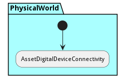
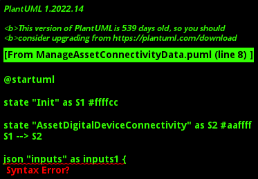

# Manage Asset Connectivity

Description of workflow to manage connection of assets to devices

## Activities

* Init - Start connectivity process
* [AssetDigitalDeviceConnectivity](scenario-AssetDigitalDeviceConnectivity) - 

### Init

Start connectivity process

*Package* - PhysicalWorld

*Actor* - Actor

#### Inputs

* asset : ref - The asset to be connected
* device : ref - The device to be connected to
#### Outputs

* status :  - Connected status of the device

#### Next Activities

* AssetDigitalDeviceConnectivity 

### AssetDigitalDeviceConnectivity

*Type* - scenario

*Package* - PhysicalWorld

#### Inputs

* asset : ref - Physical asset
* device : ref - Digital device

#### Next Activities

