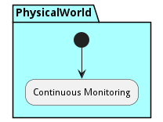
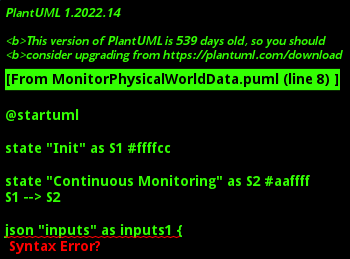

# Monitor Physical World

Description of workflow to monitor the physical world

## Activities

* Init - Start monitoring process
* [Continuous Monitoring](scenario-ContinuousMonitoring) - 

### Init

Start monitoring process

*Package* - PhysicalWorld

*Actor* - Actor

#### Inputs

* asset : ref - The asset to be monitored
#### Outputs

* status :  - Monitoring status of the asset

#### Next Activities

* Continuous Monitoring 

### Continuous Monitoring

*Type* - scenario

*Package* - PhysicalWorld

#### Inputs

* asset : ref - Physical asset

#### Next Activities

